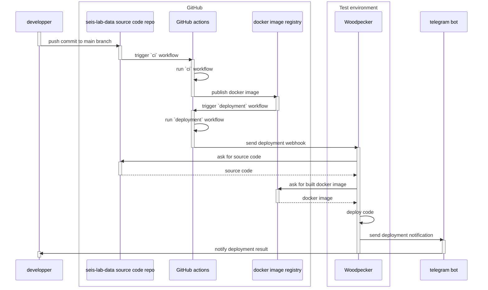

# seis-lab-data

Marine data catalog for internal usage at [IPMA]


## Test environment

https://seis-lab-data.naturalgis.pt


Test environment deployments are handled by a [woodpecker] instance and the relevant workflow can be found in the `.woodpecker`
directory of this repo. Deployments are triggered by GitHub actions, via a webhook notification that is sent by
the `.github/deployment.yml` workflow.



Woodpecker is running at <https://ci.seis-lab-data.naturalgis.pt>

In addition to the contents of the webhook message, deployments rely on the woodpecker instance having the
following secrets defined:

- `github_user` - Name of the GitHub user that interacts with the GitHub container registry and pulls images of
  the project to be deployed
- `github_pat` - Personal Access Token for logging in to the container registry
- `telegram_bot_token` - Token for the telegram bot that sends deployment-related notifications
- `telegram_chat_id` - Id of the telegram chat where deployment-related notifications should be dispatched

In the test env node, relevant deployment artifacts are located at `/opt/seis-lab-data`. The most relevant files are:

- `compose.test-env.yaml` - docker compose file which is used by the woodpecker deployment workflow to orchestrate
  deployments - This file is a copy of the repo's `docker/compose.test-env.yaml` file which is created by woodpecker
  during the deployment. Do not edit this file manually, but rather commit any changes to the repo
- `compose-deployment.env`, contains environment variables used by the compose file and is crucial for deployments to
  work OK

There are other deployment-related files under `/opt/seis-lab-data`, which should not be modified.


### Checking logs

Access both deployment-related and operation logs can be done using normal docker facilities.

> [!NOTE]
> Because our `compose.test-env.yaml` expects to find some environment variables in order to work OK it is not
> easy to scope docker compose commands to only consider the sld project services. This means that instead of
>
> ```shell
> docker compose -f compose.test-env.yaml <docker-command> <service-name>
> ```
>
> You should use the more general form instead, which relies on knowing the name of running containers, like this:
>
> ```shell
> docker <docker-command> <container-name>
> ```
>
> You can easily discover the names of running containers with this command:
>
> ```shell
> docker ps --format json | jq -r '.Names'
> ```
>
> Note that all services related to the seis-lab-data system generate containers whose name is prefixed with
> `seis-lab-data-`.

Deployment logs can be inspected via the woodpecker's compose stack logs:

```shell
# see logs from the last ten minutes and keep following the logs
docker logs -f --since 10m woodpecker-woodpecker-server-1
```

The running system also uses traefik instance as a reverse proxy. This instance is configured in its own compose file
and logs can be inspected with:

```shell
docker logs -f --since 10m traefik-traefik-1
```

Seis-lab-data service logs can be checked with:

```shell
# example of checking the logs of the 'webapp' service
docker logs -f --since 10m seis-lab-data-webapp-1
```


## Development

- Clone this repo
- Make a symlink to the directory where you have your sample data into a `sample-data` directory under the root of the
  project - For example:

   ```shell
   # assuming your sample-data directory lives at `~/my-seis-lab-data-sample-data`
   ln -s ~/my-seis-lab-data-sample-data sample-data
   ```

- Ensure you have installed [docker] and [uv] on your machine
- Create a Python virtualenv and install the project dependencies into it with:

    ```shell
    cd seis-lab-data
    uv sync --group dev --locked
    ```

- Install the included [pre-commit] hooks:

    ```shell
    uv run pre-commit install
    ```

- Setup your favorite IDE for working on the project
- Launch the services with docker compose:

    ```shell
    docker compose -f docker/compose.dev.yaml up -d
    ```

- Ensure the database is up to date by running:

    ```shell
    docker compose -f docker/compose.dev.yaml exec -ti webapp uv run seis-lab-data db upgrade
    ```

- Add default data:

    ```shell
    docker compose -f docker/compose.dev.yaml exec -ti webapp uv run seis-lab-data bootstrap all
    ```

- Optionally, load sample records into the DB:

    ```shell
    docker compose -f docker/compose.dev.yaml exec -ti webapp uv run seis-lab-data dev load-all-samples
    ```

- You should now be able to access the webapp at

    http://localhost:8888

- Additional relevant URLs:

  - http://localhost:8887 - the traefik dashboard
  - http://localhost:8887/auth/ - the authentik landing page


> [!NOTE]
> ### Building the docker image locally
>
> Most of the time you will be using a prebuilt docker image. However, there is a special case where you will need
> to build it locally. This case is when you add a new python dependency to the project. In this case, build the
> image with:
>
> ```shell
> docker build \
>   --tag ghcr.io/naturalgis/seis-lab-data/seis-lab-data:$(git branch --show-current) \
>   --file docker/Dockerfile \
>   .
> ```
>
> Then stand up the docker compose stack with:
>
> ```shell
> CURRENT_GIT_BRANCH=$(git branch --show-current) docker compose -f docker/compose.dev.yaml up -d --force-recreate
> ```

> [!NOTE]
> ### Getting translations to work correctly in your local dev environment
>
> Because the docker compose file used for dev bind mounts the entire `src` directory, it will
> mask the container's own compiled `*.mo` files. This means that after running
> `seis-lab-data translations compile` you need to restart the `webapp` service for the changes to take effect.


### Data


## Running tests

Normal tests can be run from inside the `webapp` compose container, after installing the required dependencies:

```shell
docker compose --file docker/compose.dev.yaml exec webapp uv sync --locked --group gdal --group dev
docker compose --file docker/compose.dev.yaml exec webapp uv run pytest
```

Integration tests can be run with the following incantation:

```shell
docker compose --file docker/compose.dev.yaml exec webapp uv run pytest -m integration
```

### End to end tests

End to end tests are run from outside the docker stack. They require that playwright is installed locally.
You can do this with:

```shell
uv run playwright install --with-deps chromium
```

Then tests can be run with:

```shell
uv run pytest \
    tests/e2e/ \
    -m e2e \
    --confcutdir tests/e2e \
    --user-email akadmin@email.com \
    --user-password admin123 \
    --base-url http://localhost:8888
```

The previous incantation will run all end to end tests in headless mode.
To run them in headed mode, you can use:

```shell
uv run pytest \
    tests/e2e/ \
    -m e2e \
    --confcutdir tests/e2e \
    --user-email akadmin@email.com \
    --user-password admin123 \
    --base-url http://localhost:8888 \
    --headed \
    --slowmo 1500
```

> [!NOTE]
> ##### Writing end to end tests
>
> Run an interactive shell with ipython. Start the browser in headed mode:
>
> ```python
> # when using ipython, playwright must be used in async mode
> from playwright.async_api import (
>     async_playwright,
>     expect,
> )
> async with async_playwright() as p:
>     browser = await p.chromium.launch(headless=False, slow_mo=1500)
>     page = await browser.new_page()
>     await page.goto("http://localhost:8888")
>
> ```

[docker]: https://www.docker.com/
[IPMA]: https://www.ipma.pt/pt/index.html
[pre-commit]: https://pre-commit.com/
[uv]: https://docs.astral.sh/uv/
[woodpecker]: https://woodpecker-ci.org/
