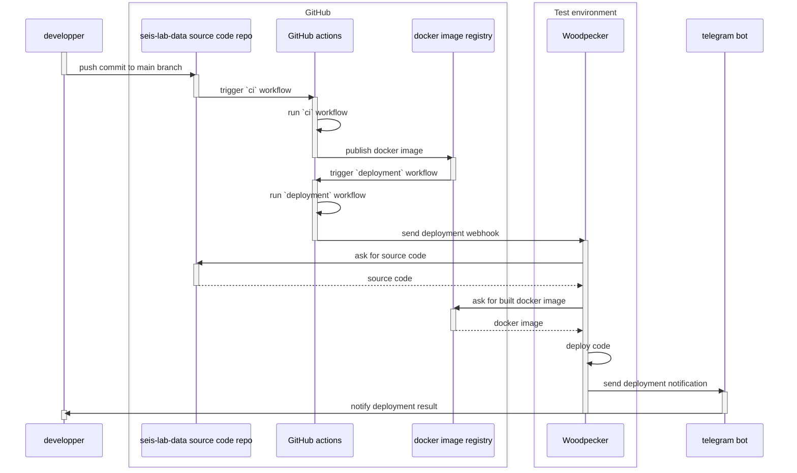

# seis-lab-data

Marine data catalog for internal usage at [IPMA]


## Development

This project is composed of a set of multiple services which are deployed with `docker compose`. The
`docker/compose.dev.yaml` file is a compose file suitable for development

> [!note]
> When the development docker stack is up and running, run docker compose commands with this incantation:
>
> ```shell
> docker compose -f docker/compose.dev.yaml <docker-command> <service-name>
> ```
>
> This makes it easier to scope the commands to this project

The more relevant services are:

- `webapp` - the main web application, which is implemented with [starlette], [sqlmodel], [jinja] and [datastar]
- `processing-worker` - the background worker that does most processing and
  state-changing DB modifications. It is a [dramatiq] worker
- `message-broker` - a [redis] instance that passes messages between the webapp and the processing worker
- `web-gateway` - a [traefik] instance that acts as a reverse proxy for the system
- `auth-webapp` - an [authentik] instance that takes care of user authentication
- `caddy-file-server` - a [caddy] instance that serves local datasets via HTTP

[authentik]: https://goauthentik.io/
[caddy]: https://caddyserver.com/
[datastar]: https://data-star.dev/
[dramatiq]: https://dramatiq.io/
[jinja]: https://jinja.palletsprojects.com/en/stable/
[redis]: https://redis.io/
[starlette]: https://starlette.dev/
[sqlmodel]: https://sqlmodel.tiangolo.com/
[traefik]: https://traefik.io/


### Environment set up

Start by retrieving the sample datasets that have been made available by the
client. These are contained in the file

```ipma/2025-marine-data-catalog/sample-data/20251125_datasample01_restored_data.tar.gz```

which is available at the internal knowledge base platform (you should know how to retrieve it).

Create a base directory for the project's datasets (for example at `~/data/seis-lab-data`)
and then get the archive and extract it inside this directory:

```shell
mkdir -p ~/data/seis-lab-data
cd ~/data/seis-lab-data

# now get the tar archive into this dir and extract it
tar -xvf 20251125_datasample01_restored_data.tar.gz

# remove the archive after extraction
rm 20251125_datasample01_restored_data.tar.gz
```

You should get something that looks like this (this is an abbreviated listing):

```shell
ricardo@tygra:~/data/seis-lab-data/$ tree -L 4
.
└── prr_eolicas
    └── base-final
        └── surveys
            └── owf-2025
```

Now clone this repo locally:

```shell
cd ~/dev  # or wherever you want to store the code

git clone https://github.com/NaturalGIS/seis-lab-data.git
cd seis-lab-data
```

In order to simplify mounting the data directory inside docker services, the project assumes
there is a `sample-data` directory under the root of the repo. As such, make a symlink
pointing to the data directory you created above:

 ```shell
 # assuming your sample-data directory lives at `~/data/seis-lab-data`
 ln -s ~/data/seis-lab-data sample-data
 ```

Ensure you have installed [docker] and [uv] on your machine

Use `uv` to get the project installed locally.

```shell
uv sync --group dev --locked
```

Install the included [pre-commit] hooks:

```shell
uv run pre-commit install
```

Pull the project docker images from their respective registries. You will likely need to log in
to the `ghcr.io` registry.

```shell
docker compose -f docker/compose.dev.yaml pull
```

Then launch the stack:

```shell
docker compose -f docker/compose.dev.yaml up -d
```

You should now be able to access the webapp at

    http://localhost:8888

Please continue with the [bootstrapping](#bootstrapping-a-fresh-installation) section.


### Bootstrapping a fresh installation

The bootstrap process consists of:

- Creating/upgrading the database;
- Loading all default variables into the apropriate DB tables;
- Optionally adding some default projects, survey missions and survey-related records.

Bootstrapping is done by using the `seis-lab-data` CLI, which is available in the `webapp`
service. It contains many commands and can be called like this:

```shell
docker compose -f docker/compose.dev.yaml exec -ti webapp uv run seis-lab-data --help
```

Run the following commands:

```shell
# initialize the DB
docker compose -f docker/compose.dev.yaml exec -ti webapp uv run seis-lab-data db upgrade

# add default data
docker compose -f docker/compose.dev.yaml exec -ti webapp uv run seis-lab-data bootstrap all

# optionally, load sample records
docker compose -f docker/compose.dev.yaml exec -ti webapp uv run seis-lab-data dev load-all-samples

# also optionally, generate a large number of synthetic records
# (this is perhaps more useful when working on the web UI)
docker compose -f docker/compose.dev.yaml exec -ti webapp uv run seis-lab-data dev generate-many-projects --num-projects=50
```

### Additional notes

The docker image used for development uses docker's `latest` tag and is rebuilt whenever there are commits to the
repo's `main` branch. As such you should be sure to run

```shell
docker compose -f docker/compose.dev.yaml pull webapp
docker compose -f docker/compose.dev.yaml up -d
```

whenever you know there have been recent merges.


> [!NOTE]
> ### Building the docker image locally
>
> Most of the time you will be using a prebuilt docker image. However, there is a special case where you will need
> to build it locally. This case is when you add a new Python dependency to the project. In this case, build the
> image with:
>
> ```shell
> docker build \
>   --tag ghcr.io/naturalgis/seis-lab-data/seis-lab-data:$(git branch --show-current) \
>   --file docker/Dockerfile \
>   .
> ```
>
> Then stand up the docker compose stack with:
>
> ```shell
> CURRENT_GIT_BRANCH=$(git branch --show-current) docker compose -f docker/compose.dev.yaml up -d --force-recreate
> ```

> [!NOTE]
> ### Getting translations to work correctly in your local dev environment
>
> Because the docker compose file used for dev bind mounts the entire `src` directory, it will
> mask the container's own compiled `*.mo` files. This means that after running
> `seis-lab-data translations compile` you need to restart the `webapp` service for the changes to take effect.


## Running tests

Normal tests can be run from inside the `webapp` compose container, after installing the required dependencies:

```shell
docker compose --file docker/compose.dev.yaml exec webapp uv sync --locked --group gdal --group dev
docker compose --file docker/compose.dev.yaml exec webapp uv run pytest
```

Integration tests can be run with the following incantation:

```shell
docker compose --file docker/compose.dev.yaml exec webapp uv run pytest -m integration
```

### End to end tests

End to end tests are run from outside the docker stack. They require that playwright is installed locally.
You can do this with:

```shell
uv run playwright install --with-deps chromium
```

Then tests can be run with:

```shell
uv run pytest \
    tests/e2e/ \
    -m e2e \
    --confcutdir tests/e2e \
    --user-email akadmin@email.com \
    --user-password admin123 \
    --base-url http://localhost:8888
```

The previous incantation will run all end to end tests in headless mode.
To run them in headed mode, you can use:

```shell
uv run pytest \
    tests/e2e/ \
    -m e2e \
    --confcutdir tests/e2e \
    --user-email akadmin@email.com \
    --user-password admin123 \
    --base-url http://localhost:8888 \
    --headed \
    --slowmo 1500
```


## Test environment

https://seis-lab-data.naturalgis.pt


Test environment deployments are handled by a [woodpecker] instance and the relevant workflow can be found in the `.woodpecker`
directory of this repo. Deployments are triggered by GitHub actions, via a webhook notification that is sent by
the `.github/deployment.yml` workflow.



Woodpecker is running at <https://ci.seis-lab-data.naturalgis.pt>

In addition to the contents of the webhook message, deployments rely on the woodpecker instance having the
following secrets defined:

- `github_user` - Name of the GitHub user that interacts with the GitHub container registry and pulls images of
  the project to be deployed
- `github_pat` - Personal Access Token for logging in to the container registry
- `telegram_bot_token` - Token for the telegram bot that sends deployment-related notifications
- `telegram_chat_id` - Id of the telegram chat where deployment-related notifications should be dispatched

In the test env node, relevant deployment artifacts are located at `/opt/seis-lab-data`. The most relevant files are:

- `compose.test-env.yaml` - docker compose file which is used by the woodpecker deployment workflow to orchestrate
  deployments - This file is a copy of the repo's `docker/compose.test-env.yaml` file which is created by woodpecker
  during the deployment. Do not edit this file manually, but rather commit any changes to the repo
- `compose-deployment.env`, contains environment variables used by the compose file and is crucial for deployments to
  work OK

There are other deployment-related files under `/opt/seis-lab-data`, which should not be modified.


### Checking logs

Access both deployment-related and operation logs can be done using normal docker facilities.

> [!NOTE]
> Because our `compose.test-env.yaml` expects to find some environment variables in order to work OK it is not
> easy to scope docker compose commands to only consider the sld project services
> (like recommended in the [development](#development) section). This means that instead of
>
> ```shell
> docker compose -f compose.test-env.yaml <docker-command> <service-name>
> ```
>
> You should use the more general form instead, which relies on knowing the name of running containers, like this:
>
> ```shell
> docker <docker-command> <container-name>
> ```
>
> You can easily discover the names of running containers with this command:
>
> ```shell
> docker ps --format json | jq -r '.Names'
> ```
>
> Note that all services related to the seis-lab-data system generate containers whose name is prefixed with
> `seis-lab-data-`.

Deployment logs can be inspected via the woodpecker's compose stack logs:

```shell
# see logs from the last ten minutes and keep following the logs
docker logs -f --since 10m woodpecker-woodpecker-server-1
```

The running system also uses traefik instance as a reverse proxy. This instance is configured in its own compose file
and logs can be inspected with:

```shell
docker logs -f --since 10m traefik-traefik-1
```

Seis-lab-data service logs can be checked with:

```shell
# example of checking the logs of the 'webapp' service
docker logs -f --since 10m seis-lab-data-webapp-1
```


[docker]: https://www.docker.com/
[IPMA]: https://www.ipma.pt/pt/index.html
[pre-commit]: https://pre-commit.com/
[uv]: https://docs.astral.sh/uv/
[woodpecker]: https://woodpecker-ci.org/
