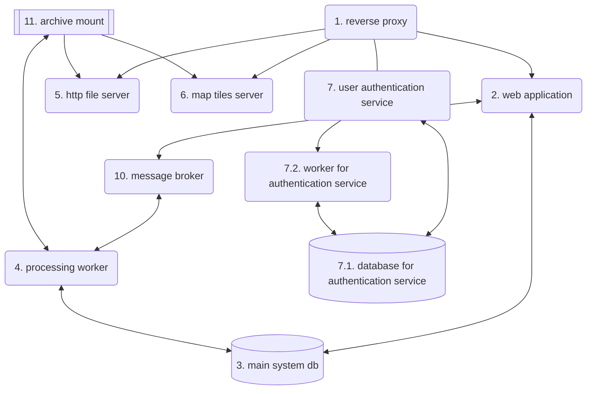

# System administration guide

This document contains a short guide for the operational maintenance of the system SeisLabData system.

## Production environment

The SeisLabData system is operational at IPMA's internal network. Its main entrypoint for users is
by accessing the URL:

<https://seis-lab-data.ipma.pt>

### System components

The system is composed of the following services:

#### 1. `reverse proxy` service

This service routes incoming HTTP requests to the appropriate handler. It performs the following
routing:

| Rule | Destination |
| ---- | ----------- |
| requests to `seis-lab-data.ipma.pt` | Routed to the `web application` service |
| requests to `auth.seis-lab-data.ipma.pt` | Routed to the `user authentication service` |
| requests to `arch.seis-lab-data.ipma.pt` | Routed to the `http file server` |
| requests to `seis-lab-data.ipma.pt/tiles` | Routed to the `map tiles server` |

##### Relevant configuration files

#### 2. `web application` service
#### 3. `main system db`

## Operational System Deployment

## Management operations

### seis-lab-data CLI tool

### start/stop the system
