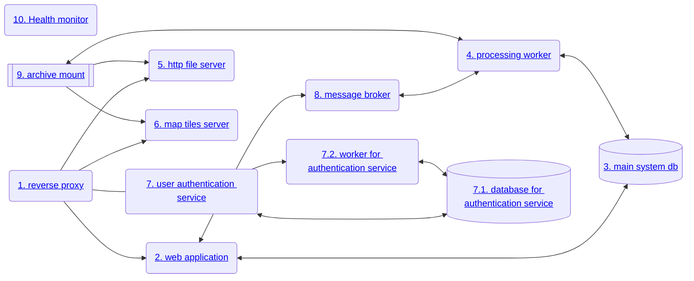

# System administration guide

This document is project deliverable _D07 - Sysadmin-oriented deployment guide_. It contains information about the
deployed SeisLabData system on IPMA's production environment and a short guide for its operational maintenance.


## Production environment overview

The SeisLabData system is operational at IPMA's internal network. Its main entrypoint for users is
by accessing the URL:

<https://seis-lab-data.ipma.pt>

The domain `seis-lab-data.ipma.pt` corresponds to the machine with internal IP `193.137.20.17`. This
machine has the following specifications:

| Property | Value |
| -------- | ----- |
| Type | VMware virtual machine |
|  Processors | 6 cores Intel Xeon @2.30GHz |
|  RAM | 30 GB |
|  Storage | -  380 GB available on the `/home` directory<br><br> -  6 TB available on the `/mnt/seislab_swap` directory |
|  Operating System | Ubuntu 24.04.3 LTS |


### System-relevant files and directories

There are four major sets of files related to the SeisLabData system:

1.  **Configuration and deployment-related files** - The system configuration is mainly composed of files
    located in the `/opt/seis-lab-data` directory, with the following structure:

    ```
    /opt/seis-lab-data/
    ├── secrets/                           # system credentials and other sensitive data
    ├── certs/                             # TLS certificates
    ├── keys/                              # TLS private keys
    ├── Caddyfile                          # HTTP file server component configuration
    ├── compose-deployment.env             # docker compose environment variables
    ├── compose.prod-env.yaml              # docker compose stack
    ├── image-url.env                      # URL of the docker image to be used to deploy the system
    ├── sld-auth-blueprint-prod-env.yaml   # authentication component configuration
    ├── traefik-prod-config.toml           # reverse-proxy component configuration
    └── traefik-tls-config.toml            # reverse-proxy component TLS configuration
    ```


2.  **Code artifacts** - The system is deployed as a set of docker images, orchestrated via docker compose. These
    images are stored in the `/var/lib/docker` directory.

3.  **Auxiliary marine datasets generated by the system** - All auxiliary datasets used by the system are stored in
    a read-write partition of the archive, mounted at the `/mnt/seislab_swap` directory.

4.  **Archived marine datasets that are indexed and shown on the main system catalogue** - The bulk of IPMA's marine
    geoseismic archive data is mounted as a read-only partition at the `/mnt/seislab_data` directory.


### Environment variables

System startup requires the presence of some environment variables. These are defined in two files:

1.  `compose-deployment.env` - This file is edited manually and contains the following variables:

    | Variable                              | Description                                                         |
    |---------------------------------------|---------------------------------------------------------------------|
    | `DEBUG`                               | Debug mode (`true`/`false`) - Should usually be set to `false`), can be set to `true` if needed, for debug purposes, but note that debug mode may impact the performance of the system. |
    | `LOG_CONFIG_FILE`                     | Path to the logging configuration file. If needed, this file can be edited in order to obtain more verbose logging output, for debug purposes. Note that verbose logging may impact the performance of the system. |
    | `AUTH_AUTHENTIK_BOOTSTRAP_PASSWORD`   | Initial password for the [user authentication service] component    |
    | `AUTH_AUTHENTIK_BOOTSTRAP_TOKEN`      | Initial token for the [user authentication service] component       |
    | `AUTH_AUTHENTIK_BOOTSTRAP_EMAIL`      | Initial email for the [user authentication service] component       |

2.  `image-url.env` - This file is rewritten each time an automated system deployment is performed. As such, it
    should not be manually edited. It contains a single variable:

    - `IMAGE_URL` - the docker image to be used in the[web application](#2-web-application-component) and [processing worker](#4-processing-worker-component) components

There are many other environment variables that can be used to configure the system. These are indicated
in the relevant section of the docker compose file `compose.prod-env.yaml`. This file is already configured
appropriately for the production environment, so under normal conditions it should not be necessary to modify it.


### External access

External access to the production environment is a highly privileged operation and should be restricted to
system administrators. The only additional access which is required is by the dev team, for the purpose
of initial configuration and subsequent deployment of new versions of the system.

Access is strictly made using SSH with public key authentication, and traffic flows only from a previously
whitelisted machine's IP address.


!!! info "Dev team access to web UI"

    For testing and debugging purposes, members of the dev team requiring access to the system web UI may open an SSH
    connection with a SOCKS proxy

    ```shell
    ssh seis-lab-data-production -N -D 1080
    ```

    And then use a web browser with proxy support. For example, google chrome:

    ```shell
    google-chrome --proxy-server="socks5://localhost:1080
    ```

    With this connection in place, the production environment can be found by browsing to

    <https://seis-lab-data.ipma.pt>


### TLS certificates

The web-facing services of the system use TLS certificates. These are managed externally by IPMA's IT team and
manually in the directories:

- `/opt/seis-lab-data/certs/` - certificates
- `/opt/seis-lab-data/keys/` - private keys

The concrete file paths are referenced in the reverse-proxy coponent configuration (`traefik-tls-config.toml`) file.


## Maintenance operations

The system is orchestrated with [docker compose], which in turn is managed by [systemd], the standard service manager
on Ubuntu.

[docker Compose]: https://docs.docker.com/compose/
[systemd]: https://systemd.io/


### Checking the status of docker service

Status of the docker services can be monitored by using the standard `systemctl` utility:

```shell
systemctl status docker.service docker.socket
```

The output of the above command should show whether the systemd services for docker are both **active** and **enabled**,
which means that docker is working and that it will restart whenever the machine is rebooted.


### Checking the status of the SeisLabData system

Being orchestrated with docker compose, the status of the running system can be checked by running the
`docker compose ps` command, with the following incantation:

```bash
cd /opt/seis-lab-data
docker compose \
    -f compose.prod-env.yaml \
    --env-file compose-deployment.env \
    --env-file image_url.env \
    ps --all \
    --format "table {{.Service}}\t{{.Status}}"
```

Example output:

```shell
SERVICE              STATUS
auth-db              Up 2 weeks (healthy)
auth-webapp          Up 2 weeks (healthy)
auth-worker          Up 2 weeks (healthy)
caddy-file-server    Up 2 weeks
db                   Up 2 weeks (healthy)
dozzle               Up 2 weeks
martin-tile-server   Up 2 weeks (healthy)
message-broker       Up 2 weeks (healthy)
processing-worker    Up 2 weeks
web-gateway          Up 2 weeks
webapp               Up 2 weeks
```

The output shows a listing with the system services and their operational status.

System restart policies can be checked by running the `docker inspect` command for each system-related container:

```shell
docker compose \
    -f compose.prod-env.yaml \
    --env-file compose-deployment.env \
    --env-file image_url.env \
    ps --all --quiet \
    | xargs docker inspect --format '{{.Name}} → restart: {{.HostConfig.RestartPolicy.Name}}'
```

Example output:

```shell
/seis-lab-data-auth-db-1 → restart: unless-stopped
/seis-lab-data-auth-webapp-1 → restart: unless-stopped
/seis-lab-data-auth-worker-1 → restart: unless-stopped
/seis-lab-data-caddy-file-server-1 → restart: unless-stopped
/seis-lab-data-db-1 → restart: unless-stopped
/seis-lab-data-dozzle-1 → restart: unless-stopped
/seis-lab-data-martin-tile-server-1 → restart: unless-stopped
/seis-lab-data-message-broker-1 → restart: unless-stopped
/seis-lab-data-processing-worker-1 → restart: unless-stopped
/seis-lab-data-web-gateway-1 → restart: unless-stopped
/seis-lab-data-webapp-1 → restart: unless-stopped
```

The output of the command should show, for each service, the value of `unless-stopped`, which means that docker ensures
the service is running unless manually stopped[^1]. This means that in case of a machine reboot, systemd ensures the
docker engine is booted successfully, and docker ensures the SeisLabData system is also booted.

[^1]: For more information, check the docs on docker compose restart policies: <https://docs.docker.com/reference/compose-file/services/#restart>


### Manually starting and stopping the system

As noted above, the system is configured to remain in continuous operation, including surviving
machine reboots. Nevertheless, if necessary, it can be managed manually.


**Start all services**

```bash
cd /opt/seis-lab-data
docker compose \
    -f compose.prod-env.yaml \
    --env-file compose-deployment.env \
    --env-file image-url.env \
    up -d
```

**Stop all services**

```bash
docker compose \
    -f compose.prod-env.yaml \
    --env-file compose-deployment.env \
    --env-file image-url.env \
    down
```

!!! warning
    The `down` command does not remove persistent volumes (databases). If there is a need to remove
    all persistent data, add the `--volumes` flag. This will delete docker volumes, so be sure to have a suitable
    backup strategy in place before using this flag.


**Start an individual service**

To restart an individual service:

```shell
docker compose -f compose.prod-env.yaml restart <service-name>
```


### Docker service monitoring

Monitoring of the system logs can be done by either:

1.  Using the standard systemd `journald` component

    The docker engine is configured to use the `journald` logging driver[^5]. As such, logs for the various services
    can be consulted using journald. As an example, logs of the `webapp` docker service from the last hour can be
    inspected with:

    ```shell
    sudo journalctl -b CONTAINER_NAME=seis-lab-data-webapp-1 --since="1 hour ago"
    ```

    !!! tip "How to find container names"

        It is possible to find container names by using the `docker compose ps` command:

        ```shell
        docker compose \
            -f compose.prod-env.yaml \
            --env-file compose-deployment.env \
            --env-file image_url.env \
            ps --all \
            --format "table {{.Name}}"
        ```

2.  Using the `docker compose logs` command

    docker compose comes with a `docker compose logs` command, which can also be used to monitor logs. As an example,
    checking simultaneous logs for all services starting from five minutes ago and continuing to show logs in real-time:

    ```shell
    docker compose \
    -f compose.prod-env.yaml \
    --env-file compose-deployment.env \
    --env-file image_url.env \
    logs --since 5m --follow
    ```

3.  Using the `health monitor` component of the system, via a web browser. Access

    <https://seis-lab-data.ipma.pt/monitoring>

    with a valid Authentik account and use the graphical User Interface to consult the logs


[^5]: More details about the `journald` docker log driver: <https://docs.docker.com/engine/logging/drivers/journald/>


## Deploying new versions of the system

New versions of the system are deployed using a semi-automated workflow. When a new version of the system is deemed
production-ready, a member of the dev team manually generates a git tag and pushes it to the source code repository.

Example git commands:

```shell
# generate git tag named with the expected pattern of vX.Y.Z
git tag --annotate --message='Tagged version 1.0.2' v1.0.2

# push the newly generated tag to the central remote, here named upstream
git push upstream v1.0.2
```

This then sets off a sequence of automated procedures that culminates with the new version being deployed.
The full deployment sequence is:

1.  Dev team member creates a git tag with a naming pattern of `vX.Y.Z` and pushes this tag to the central
    Github-hosted source code repository

2.  When the tag arrives at the repository, the workflow in `.github/workflows.ci.yaml` runs, performing the
    following steps:

    1.  Perform static analysis of the code to check for errors;

    2.  Format the code in accordance to standard styling;

    3.  Build a docker image with the code - this is the artifact that will ultimately get deployed;

    4.  Run various tests using the built docker image - these include both unit, integration and end-to-end tests;

    5.  Publish the built docker image in the repository's docker registry. This registry is available at:

        <https://github.com/NaturalGIS/seis-lab-data/pkgs/container/seis-lab-data%2Fseis-lab-data>

    6.  Call the `.github/workflows/deployment-initiator.yml` workflow, which posts a webhook to the dev team's
        deployment machine, notifying that a new version is ready to be deployed

3.  The deployment machine is running the [woodpecker CI] tool for managing deployments. This tool receives the
    webhook notification and uses the instructions present in the `.woodpecker/deployment.yaml` file to handle the
    deployment.

    !!! note "GitHub repository cannot access IPMA production environment"
        Note that the GitHub-hosted source code repository is not allowed to access IPMA's production environment and
        does not store any access credentials for it - access is always done via the deployment machine, which
        is fully controlled and secured by the dev team.

        The dev machine's deployment tool is accessible (to authorized users) at:

        <https://ci.seis-lab-data.naturalgis.pt>


4.  The deployment machine now kicks-off the following workflow:

    1.  Validate the GitHub webhook
    2.  Connect to the production environment via SSH
    3.  Update relevant configuration files
    4.  Pull the previously built docker image of the system from the docker registry
    5.  Restart the docker compose stack
    6.  Send a notification to the dev team when the deployment is done


### Performing manual deployments

While the preferred deployment workflow is the semi-automated procedure described above, it is also possible
to perform manual deployments:

1.  Create a git tag with a naming pattern of `vX.Y.Z` and pushes this tag to the central
    Github-hosted source code repository (see the example git commands posted in the beginning of this section);

2.  Edit the `/opt/seis-lab-data/image-url.env` file and update `IMAGE_URL` to the new image version;

3.  Perform the deployment:

```bash
docker compose \
    -f compose.prod-env.yaml \
    --env-file compose-deployment.env \
    --env-file image-url.env \
    up -d --force-recreate webapp processing-worker
```

4. If the new version includes database migrations, run after the previous step:

```bash
docker compose \
    -f compose.prod-env.yaml \
    --env-file compose-deployment.env \
    --env-file image-url.env \
    exec webapp uv run seis-lab-data db upgrade
```

[woodpecker CI]: https://woodpecker-ci.org/


## System components

This section contains a brief description of the main components of the SeisLabData system.

<span class="no-pdf">

```mermaid
flowchart LR
    monitor(<a href="#10-health-monitor-component">10. Health monitor</a>)
    rev-proxy(<a href="#1-reverse-proxy-component">1. reverse proxy</a>)
    webapp(<a href="#2-web-application-component">2. web application</a>)
    db[(<a href="#3-main-system-db-component">3. main system db</a>)]
    proc-worker(<a href="#4-processing-worker-component">4. processing worker</a>)
    file-server(<a href="#5-http-file-server-component">5. http file server</a>)
    tile-server(<a href="#6-map-tiles-server-component">6. map tiles server</a>)
    auth-webapp(<a href="#7-user-authentication-service-component">7. user authentication service</a>)
    auth-db[(<a href="#71-database-for-authentication-service-component">7.1. database for authentication service</a>)]
    auth-worker(<a href="#72-worker-for-authentication-service-component">7.2. worker for authentication service</a>)
    message-broker(<a href="#8-message-broker-component">8. message broker</a>)
    arch[[<a href="#9-archive-mount-component">9. archive mount</a>]]
    rev-proxy --> webapp
    rev-proxy --> file-server
    rev-proxy --> tile-server
    rev-proxy --- auth-webapp
    auth-webapp <--> auth-db
    auth-webapp --> auth-worker
    auth-worker <--> auth-db
    webapp <--> db
    proc-worker <--> db
    webapp <--> message-broker
    message-broker <--> proc-worker
    arch --> file-server
    arch --> tile-server
    arch <--> proc-worker
```
</span>

#### 1. `reverse proxy` component

This component is a [Traefik](https://doc.traefik.io/traefik/) instance. It receives HTTP requests
and routes them to the appropriate service, according to the rules in the table below:

| Routing rule                                          | Destination service             |
|-------------------------------------------------------|---------------------------------|
| host: `seis-lab-data.ipma.pt`                         | `web application`               |
| host: `auth.seis-lab-data.ipma.pt`                    | `user authentication service`   |
| host: `data.seis-lab-data.ipma.pt`                    | `http file server`              |
| host: `seis-lab-data.ipma.pt`<br> path: `/tiles`      | `map tiles server`              |
| host: `seis-lab-data.ipma.pt`<br> path: `/monitoring` | `log viewer`                    |


##### Relevant configuration files

- `traefik-prod-config.toml` - Traefik static configuration
- `traefik-tls-config.toml` - file indicating the location of TLS certificates
- `compose.prod-env.yaml` - Traefik dynamic configurations are defined as Docker labels in this file


#### 2. `web application` component

This is the main component of the system. It consists of a web application that serves the graphical
interface and the API that allows interaction with the catalogue.


##### Relevant configuration files

- `compose.prod-env.yaml` - `webapp` service; configuration is done via docker compose's support for environment
  variables. These are set in the `environment` section of the `webapp` service
- `secrets/sld-database-dsn` - main database access credentials
- `secrets/auth-client-id` and `secrets/auth-client-secret` - authentication service access credentials used by
  the webapp when needing to contact the authentication service


#### 3. `main system db` component

[PostgreSQL](https://www.postgresql.org/) instance with the PostGIS extension. Stores the system's
catalog records.


##### Relevant configuration files

- `compose.prod-env.yaml` - `db` service
- `secrets/db-passowrd` - Contains the password of the database user


!!! note "Direct access to the database"

    The `compose.prod-env.yaml` file does not publish any ports from the database docker service to the local host.
    This means the database can only be accessed from the machine where the system is installed and that access must
    be done by connecting to the `db` service directly.

    Example command:

    ```bash
    docker compose \
        -f compose.prod-env.yaml \
        --env-file compose-deployment.env \
        --env-file image-url.env \
        exec db psql -U sld -d seis_lab_data
    ```


#### 4. `processing worker` component

[Dramatiq](https://dramatiq.io/) application that executes background tasks, like the creation
and processing of records in the system. Communicates with the webapplication mostly via a publish/subscribe
pattern[^2] application through the `message broker` component.

[^2]: General overview of the publish/subscribe pattern: <https://en.wikipedia.org/wiki/Publish%E2%80%93subscribe_pattern>


#### 5. `http file server` component

[Caddy](https://caddyserver.com/) instance that serves the data archive files at
`data.seis-lab-data.ipma.pt`. Access is controlled by the authentication service via Traefik
forward authentication[^3].

[^3]: traefik forward authentication docs: <https://doc.traefik.io/traefik/reference/routing-configuration/http/middlewares/forwardauth/>


##### Relevant configuration files

- `Caddyfile` - Caddy server configuration
- `compose.prod-env.yaml` - `caddy-file-server` service


#### 6. `map tiles server` component

[Martin](https://martin.maplibre.org/) instance that serves vector map tiles from the PostGIS
database and PMTiles files. Accessible under the `/tiles` path of the main domain.


##### Relevant configuration files

- The Martin configuration file is maintained as a Docker secret at
  `/opt/seis-lab-data/secrets/martin-config.yaml`


#### 7. `user authentication service` component

[Authentik](https://goauthentik.io/) instance that manages user authentication and authorization
via OpenID Connect[^4]. Accessible at `auth.seis-lab-data.ipma.pt`. The system defines two user groups:

[^4]: Overview OpenID connect: <https://openid.net/developers/how-connect-works/>

- `seis-lab-data-editors` - users with permission to edit records
- `seis-lab-data-catalog-admins` - catalogue administrators

User management (account creation, group assignment, password reset) is done through the Authentik
administration panel, accessible at `auth.seis-lab-data.ipma.pt/if/admin/`.


##### Relevant configuration files

- `sld-auth-blueprint-prod-env.yaml` - Authentik initial configuration blueprint
- Relevant secrets: `auth-secret-key`, `auth-client-id`, `auth-client-secret`,
  `auth-db-password`, `auth-email-username`, `auth-email-password`


#### 7.1. `database for authentication service` component

PostgreSQL instance dedicated to Authentik. Not shared with the main system database.


#### 7.2. `worker for authentication service` component

Authentik worker component, responsible for background tasks such as sending emails and applying
blueprints.


#### 8. `message broker` component

[Redis](https://redis.io/) instance used both as a message queue and message broker between the `web application` and the
`processing worker` components.


##### Relevant configuration files

There is no relevant configuration for this component.


#### 9. `archive mount` component

This component consists of the volumes that mount the archive filesystem on the node containing
the installation.

| Mount point on the server | Purpose                                                                                          |
|---------------------------|--------------------------------------------------------------------------------------------------|
| `/mnt/seislab_data`       | Allows the system to access datasets in IPMA's archive — this mount is read-only.               |
| `/mnt/seislab_swap`       | Mount with write access. This space is used by the system to store information it generates.     |

These volumes are subsequently mounted inside the relevant docker containers so that they can be
used by system services:

- [4. `processing worker` component](#4-processing-worker-component)
- [5. `http file server` component](#5-http-file-server-component)
- [6. `map tiles server` component](#6-map-tiles-server-component)


#### 10. `health monitor` component

[Dozzle](https://dozzle.dev/) instance that allows viewing the logs of all services in real time
through a web interface. Accessible at `seis-lab-data.ipma.pt/monitoring`. Access is protected by
the authentication service.
