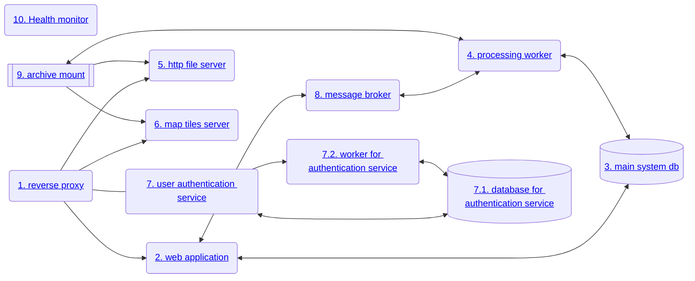

# System administration guide

<span class="no-pdf">
    [ :material-file-pdf-box: Download PDF version](assets/documents/seis-lab-data-administration-guide.pdf){ .md-button .no-pdf }
</span>

This document contains a short guide for the operational maintenance of the SeisLabData system.


## Production environment

The SeisLabData system is operational at IPMA's internal network. Its main entrypoint for users is
by accessing the URL:

<https://seis-lab-data.ipma.pt>

The domain `seis-lab-data.ipma.pt` corresponds to the machine with internal IP `193.137.20.17`. This
machine has the following specifications:

| Property | Value |
| -------- | ----- |
| Type | VMware virtual machine |
|  Processors | 6 cores Intel Xeon @2.30GHz |
|  RAM | 30 GB |
|  Storage | -  380 GB available on the `/home` directory<br><br> -  6 TB available on the `/mnt/seislab_swap` directory |
|  Operating System | Ubuntu 24.04.3 LTS |


### File structure on the server

The system is mainly composed of files located in the `/opt/seis-lab-data` directory, with the following structure:

```
/opt/seis-lab-data/
├── secrets/                           # system credentials and other sensitive data
├── certs/                             # TLS certificates
├── keys/                              # TLS private keys
├── Caddyfile                          # Web server component configuration
├── compose-deployment.env             # docker compose environment variables
├── compose.prod-env.yaml              # docker compose stack
├── image-url.env                      # URL of the docker image to be used to deploy the system
├── sld-auth-blueprint-prod-env.yaml   # authentication service configuration
├── traefik-prod-config.toml           # reverse-proxy component configuration
└── traefik-tls-config.toml            # reverse-proxy component TLS configuration
```

Datasets are stored in the archive mounts:

- `/mnt/seislab_data` - Read-only access to the archive
- `/mnt/seislab_data` - Write are for storing files produced by the system


### TLS certificates

TLS certificates are managed externally and placed manually in the directories:

- `/opt/seis-lab-data/certs/` - certificates
- `/opt/seis-lab-data/keys/` - private keys

The concrete file paths are referenced in the reverse-proxy coponent configuration (`traefik-tls-config.toml`) file.


### Environment variables

The system startup requires the presence of some environment variables. These are defined in two
files. The `compose-deployment.env` file is edited manually and contains the following variables:

| Variable                              | Description                                                         |
|---------------------------------------|---------------------------------------------------------------------|
| `DEBUG`                               | Debug mode (`true`/`false`) - Should usually be set to `false`), can be set to `true` if needed, for debug purposes, but note that debug mode may impact the performance of the system. |
| `LOG_CONFIG_FILE`                     | Path to the logging configuration file. If needed, this file can be edited in order to obtain more verbose logging output, for debug purposes. Note that verbose logging may impact the performance of the system. |
| `AUTH_AUTHENTIK_BOOTSTRAP_PASSWORD`   | Initial password for the [user authentication service] component    |
| `AUTH_AUTHENTIK_BOOTSTRAP_TOKEN`      | Initial token for the [user authentication service] component       |
| `AUTH_AUTHENTIK_BOOTSTRAP_EMAIL`      | Initial email for the [user authentication service] component       |

The `image-url.env` file is rewritten each time an automated system installation is performed.
As such, it should not be manually edited. It contains a single variable:

- `IMAGE_URL` - the docker image to be used in the
  [web application](#2-web-application-component) and [processing worker](#4-processing-worker-component) components

There are many other environment variables that can be used to configure the system. These are indicated
in the relevant section of the docker compose file `compose.prod-env.yaml`. This file is already configured
appropriately for the production environment, so under normal conditions it should not be necessary to modify it.


### External access

External access to the production environment is a highly privileged operation and should be restricted to
system administrators. The only additional access which is required is by the system dev team, for the purpose
of initial configuration and subsequent deployment of newer versions of the system.

Access is strictly made using SSH with public key authentication, and traffic flows only from a previously
whitelisted machine's IP address.


!!! NOTE "Dev team access"

    For testing and debugging purposes, members of the dev team requiring access to the system web UI may open an SSH
    connection with a SOCKS proxy

    ```shell
    ssh seis-lab-data-production -N -D 1080
    ```

    And then use a web browser with proxy support. For example, google chrome:

    ```shell
    google-chrome --proxy-server="socks5://localhost:1080
    ```

    With this connection in place, the production environment can be found by browsing to

    <https://seis-lab-data.ipma.pt>


## Maintenance operations

The system is orchestrated with [docker compose], which in turn is managed by [systemd]. This means that:

[docker Compose]: https://docs.docker.com/compose/
[systemd]: https://systemd.io/

- The docker service is managed by systemd, which takes care of starting/stopping operating system services
  automatically. If the machine is rebooted, docker recovers autonomously.

- system start/stop is managed by docker compose. The `compose.prod-env.yaml` file contains
  instructions to automatically restart all system services. This means that if the machine is rebooted,
  the system recovers autonomously.


### Manually starting and stopping the system

As noted above, the system is configured to remain in continuous operation, including surviving
machine reboots. Nevertheless, if necessary, it can be managed manually.

Start all services:

```bash
cd /opt/seis-lab-data
docker compose \
    -f compose.prod-env.yaml \
    --env-file compose-deployment.env \
    --env-file image-url.env \
    up -d
```

Stop all services:

```bash
docker compose \
    -f compose.prod-env.yaml \
    --env-file compose-deployment.env \
    --env-file image-url.env \
    down
```

!!! WARNING
    The `down` command does not remove persistent volumes (databases). If there is a need to remove
    all persistent data, add the `--volumes` flag. This will delete docker volumes, so be sure to have a suitable
    backup strategy in place before using this flag.

To restart an individual service:

```shell
docker compose -f compose.prod-env.yaml restart <service-name>
```


### Docker service monitoring

**Via web interface (Dozzle):**

Access `https://seis-lab-data.ipma.pt/monitoring` with a valid Authentik account.

**Via command line:**

```shell
# Logs for a specific service
docker compose -f compose.prod-env.yaml logs -f webapp

# Logs for all services, showing only output
# generated in the last 10 minutes
docker compose -f compose.prod-env.yaml logs -f --since 10m
```

Logs are managed by systemd, so it is also possible to use the `journalctl` command
for inspection:

```shell
sudo journalctl ...
```


### seis-lab-data CLI tool

The application includes a command-line tool, accessible inside the `webapp` container:

```bash
docker compose -f compose.prod-env.yaml exec webapp seis-lab-data --help
```

Available commands:

| Command                               | Description                                            |
|---------------------------------------|--------------------------------------------------------|
| `seis-lab-data db upgrade`            | Runs pending database migrations                       |
| `seis-lab-data bootstrap all`         | Initialises the system base data                       |
| `seis-lab-data run-web-server`        | Starts the web server (invoked by Docker)              |
| `seis-lab-data run-processing-worker` | Starts the processing worker (invoked by Docker)       |


### Updating the application

1. Edit the `image-url.env` file and update `IMAGE_URL` to the new image version.
2. Apply the update:

```bash
docker compose \
    -f compose.prod-env.yaml \
    --env-file compose-deployment.env \
    --env-file image-url.env \
    up -d webapp processing-worker
```

3. If the new version includes database migrations, run after the previous step:

```bash
docker compose -f compose.prod-env.yaml exec webapp seis-lab-data db upgrade
```


## System components

The SeisLabData system is composed of the following components:

<span class="no-pdf">

```mermaid
flowchart LR
    monitor(<a href="#10-health-monitor-component">10. Health monitor</a>)
    rev-proxy(<a href="#1-reverse-proxy-component">1. reverse proxy</a>)
    webapp(<a href="#2-web-application-component">2. web application</a>)
    db[(<a href="#3-main-system-db-component">3. main system db</a>)]
    proc-worker(<a href="#4-processing-worker-component">4. processing worker</a>)
    file-server(<a href="#5-http-file-server-component">5. http file server</a>)
    tile-server(<a href="#6-map-tiles-server-component">6. map tiles server</a>)
    auth-webapp(<a href="#7-user-authentication-service-component">7. user authentication service</a>)
    auth-db[(<a href="#71-database-for-authentication-service-component">7.1. database for authentication service</a>)]
    auth-worker(<a href="#72-worker-for-authentication-service-component">7.2. worker for authentication service</a>)
    message-broker(<a href="#8-message-broker-component">8. message broker</a>)
    arch[[<a href="#9-archive-mount-component">9. archive mount</a>]]
    rev-proxy --> webapp
    rev-proxy --> file-server
    rev-proxy --> tile-server
    rev-proxy --- auth-webapp
    auth-webapp <--> auth-db
    auth-webapp --> auth-worker
    auth-worker <--> auth-db
    webapp <--> db
    proc-worker <--> db
    webapp <--> message-broker
    message-broker <--> proc-worker
    arch --> file-server
    arch --> tile-server
    arch <--> proc-worker
```
</span>

#### 1. `reverse proxy` component

This component is a [Traefik](https://doc.traefik.io/traefik/) instance. It receives HTTP requests
and routes them to the appropriate service, according to the rules in the table below:

| Routing rule                                          | Destination service             |
|-------------------------------------------------------|---------------------------------|
| host: `seis-lab-data.ipma.pt`                         | `web application`               |
| host: `auth.seis-lab-data.ipma.pt`                    | `user authentication service`   |
| host: `data.seis-lab-data.ipma.pt`                    | `http file server`              |
| host: `seis-lab-data.ipma.pt`<br> path: `/tiles`      | `map tiles server`              |
| host: `seis-lab-data.ipma.pt`<br> path: `/monitoring` | `log viewer`                    |


##### Relevant configuration files

- `traefik-prod-config.toml` - Traefik static configuration
- `traefik-tls-config.toml` - file indicating the location of TLS certificates
- `compose.prod-env.yaml` - Traefik dynamic configurations are defined as Docker labels in this file


#### 2. `web application` component

This is the main component of the system, implemented in Python. It consists of a web application
that serves the graphical interface and the API that allows interaction with the catalogue.


##### Relevant configuration files

- `compose.prod-env.yaml` - `webapp` service; configuration is done via environment variables
- `secrets/sld-database-dsn` - main database access credentials
- `secrets/auth-client-id` and `secrets/auth-client-secret` - authentication service access credentials


#### 3. `main system db` component

[PostgreSQL](https://www.postgresql.org/) instance with the PostGIS extension. Stores the system's
catalogue records.


##### Relevant configuration files

- `compose.prod-env.yaml` - `db` service
-


##### Accessing the database

The `compose.prod-env.yaml` file does not publish any ports from the database docker service. This
means the database can only be accessed from the machine where the system is installed.

Access can be done with the command:

```bash
docker compose \
    -f compose.prod-env.yaml \
    --env-file compose-deployment.env \
    --env-file image-url.env \
    exec db psql -U sld -d seis_lab_data
```


#### 4. `processing worker` component

[Dramatiq](https://dramatiq.io/) application that executes background tasks, namely the creation
and processing of records in the system. Communicates with the web application through the
`message broker`.


#### 5. `http file server` component

[Caddy](https://caddyserver.com/) instance that serves the data archive files at
`data.seis-lab-data.ipma.pt`. Access is controlled by the authentication service via Traefik
forward authentication.


##### Relevant configuration files

- `Caddyfile` - Caddy server configuration
- `compose.prod-env.yaml` - `caddy-file-server` service


#### 6. `map tiles server` component

[Martin](https://martin.maplibre.org/) instance that serves vector map tiles from the PostGIS
database and PMTiles files. Accessible under the `/tiles` path of the main domain.


##### Relevant configuration files

- The Martin configuration file is maintained as a Docker secret at
  `/opt/seis-lab-data/secrets/martin-config.yaml`


#### 7. `user authentication service` component

[Authentik](https://goauthentik.io/) instance that manages user authentication and authorisation
via OIDC/OAuth2. Accessible at `auth.seis-lab-data.ipma.pt`. The system defines two user groups:

- `seis-lab-data-editors` - users with permission to edit records
- `seis-lab-data-catalog-admins` - catalogue administrators

User management (account creation, group assignment, password reset) is done through the Authentik
administration panel, accessible at `auth.seis-lab-data.ipma.pt/if/admin/`.


##### Relevant configuration files

- `sld-auth-blueprint-prod-env.yaml` - Authentik initial configuration blueprint
- Relevant secrets: `auth-secret-key`, `auth-client-id`, `auth-client-secret`,
  `auth-db-password`, `auth-email-username`, `auth-email-password`


#### 7.1. `database for authentication service` component

PostgreSQL instance dedicated to Authentik. Not shared with the main system database.


#### 7.2. `worker for authentication service` component

Authentik worker component, responsible for background tasks such as sending emails and applying
blueprints.


#### 8. `message broker` component

[Redis](https://redis.io/) instance used as a message queue between the `web application` and the
`processing worker`.


#### 9. `archive mount` component

This component consists of the volumes that mount the archive filesystem on the node containing
the installation.

| Mount point on the server | Purpose                                                                                          |
|---------------------------|--------------------------------------------------------------------------------------------------|
| `/mnt/seislab_data`       | Allows the system to access datasets in IPMA's archive — this mount is read-only.               |
| `/mnt/seislab_swap`       | Mount with write access. This space is used by the system to store information it generates.     |

These volumes are subsequently mounted inside the relevant docker containers so that they can be
used by system services:

- [4. `processing worker` component](#4-processing-worker-component)
- [5. `http file server` component](#5-http-file-server-component)
- [6. `map tiles server` component](#6-map-tiles-server-component)


#### 10. `health monitor` component

[Dozzle](https://dozzle.dev/) instance that allows viewing the logs of all services in real time
through a web interface. Accessible at `seis-lab-data.ipma.pt/monitoring`. Access is protected by
the authentication service.


## Deployment of new versions of the system

New versions of the system are deployed using a semi-automated workflow. When a new version of the system is deemed
production-ready, a member of the dev team manually generates a git tag and pushes it to the source code repository.
This then sets off a sequence of automated procedures that culminates with the new version being deployed.
The sequence is:

1.  Dev team member creates a git tag with a naming pattern of `vX.Y.Z` and pushes this tag to the central
    Github-hosted source code repository

2.  When the git tag is pushed, the workflow in the `.github/workflows.ci.yaml` runs, performing the following steps:

    1.  Perform static analysis of the code to check for errors

    2.  Format the code in accordance to standard styling

    3.  Build a docker image with the code - this is the artifact that will ultimately get deployed

    4.  Run various tests using the built docker image - these include both unit, integration and end-to-end tests

    5.  Publish the built docker image in the repository's docker registry

    6.  Call the `.github/workflows/deployment-initiator.yml` workflow, which post a webhook to the dev team's
        deployment machine, notifying that a new version is ready to be deployed - This ends the

3.  The deployment machine is running the [woodpecker CI] tool for managing deployments. This tool receives the
    webhook notification and uses the instructions present in the `.woodpecker/deployment.yaml` file to handle the
    deployment.

    Note that the GitHub-hosted source code repository is not allowed to access IPMA's production environment - access
    is always done vie the deployment machine, which is fully controlled and secured by the dev team

4.  The deployment machine now kicks-off the following workflow:

    1.  Validate the GitHub webhook
    2.  Connect to the production environment via SSH
    3.  Update relevant configuration files
    4.  Pull the previously built docker image of the system from the docker registry
    5.  Restart the docker compose stack
    6.  Send a notification to the dev team when the deployment is done

[woodpecker CI]: https://woodpecker-ci.org/
