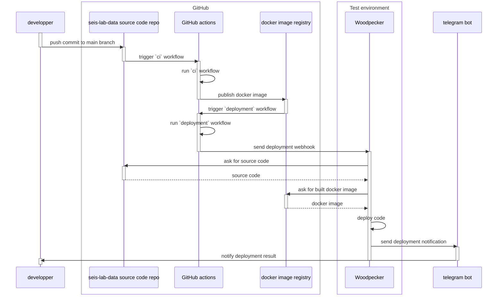

# Test environment

https://seis-lab-data.naturalgis.pt


Test environment deployments are handled by a [woodpecker] instance and the relevant workflow can be found in the `.woodpecker`
directory of this repo. Deployments are triggered by GitHub actions, via a webhook notification that is sent by
the `.github/deployment.yml` workflow.



Woodpecker is running at <https://ci.seis-lab-data.naturalgis.pt>

In addition to the contents of the webhook message, deployments rely on the woodpecker instance having the
following secrets defined:

- `github_user` - Name of the GitHub user that interacts with the GitHub container registry and pulls images of
  the project to be deployed
- `github_pat` - Personal Access Token for logging in to the container registry
- `telegram_bot_token` - Token for the telegram bot that sends deployment-related notifications
- `telegram_chat_id` - Id of the telegram chat where deployment-related notifications should be dispatched

In the test env node, relevant deployment artifacts are located at `/opt/seis-lab-data`. The most relevant files are:

- `compose.test-env.yaml` - docker compose file which is used by the woodpecker deployment workflow to orchestrate
  deployments - This file is a copy of the repo's `docker/compose.test-env.yaml` file which is created by woodpecker
  during the deployment. Do not edit this file manually, but rather commit any changes to the repo
- `compose-deployment.env`, contains environment variables used by the compose file and is crucial for deployments to
  work OK

There are other deployment-related files under `/opt/seis-lab-data`, which should not be modified.


!!! note

    Whenever there is a need to manually connect to the test environment, prefer to use a terminal session manager
    as it will keep your session running in case some unexpected break of connection. [byobu] is a nice way to handle
    this:

    ```shell
    # check if there are any sessions already created:
    byobu ls

    # create a new session (name it after yourself)
    byobu new -s ricardo-silva

    # detach from the session by pressing the <F6> key

    # reattach to a named session (you can attach to someone else's session, if needed)
    byobu attach -t ricardo-silva

    # the session can be closed by simply closing the connection, i.e. press <ctrl+d> or type `quit`
    ```

[byobu]: https://www.byobu.org/documentation


## Checking logs

Access both deployment-related and operation logs can be done using normal docker facilities.

!!! NOTE
    Because our `compose.test-env.yaml` expects to find some environment variables in
    order to work OK, be sure to specify the existing env variables file whenever
    using docker compose commands, like this:

    ```shell
    docker compose -f compose.test-env.yaml --env-file compose-deplyment.env \
        <docker-command> <service-name>
    ```


Deployment logs can be inspected via the woodpecker's compose stack logs:

```shell
# see logs from the last ten minutes and keep following the logs
docker logs -f --since 10m woodpecker-woodpecker-server-1
```

The running system also uses traefik instance as a reverse proxy. This instance is
configured in its own compose file and logs can be inspected with:

```shell
docker logs -f --since 10m traefik-traefik-1
```

Seis-lab-data service logs can be checked with:

```shell
# example of checking the logs of the 'webapp' service
docker logs -f --since 10m seis-lab-data-webapp-1
```


[docker]: https://www.docker.com/
[IPMA]: https://www.ipma.pt/pt/index.html
[pre-commit]: https://pre-commit.com/
[uv]: https://docs.astral.sh/uv/
[woodpecker]: https://woodpecker-ci.org/
