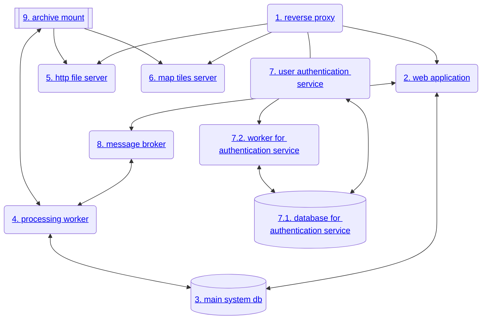

# Administração do sistema

    [ :material-file-pdf-box: Descarregar versão PDF](assets/documents/seis-lab-data-administration-guide.pdf){ .md-button .no-pdf }

Este documento contem um breve guia para auxílio na manutenção do sistema SeisLabData.

## Ambiente de produção

O sistema SeisLabData está disponível dentro da rede interna do IPMA. O seu ponto de
entrada para os utilizadores é através do URL:

<https://seis-lab-data.ipma.pt>

### Componentes do sistema

O sistema SeisLabData é composto pelos seguintes componentes:

#### 1. Serviço `reverse proxy`

Este serviço é uma instância [traefik]. Recebe pedidos HTTP e direciona-os para o serviço adequado.

| Regra de redirecionamento                    | Serviço de destino                    |
|----------------------------------------------|---------------------------------------|
| Pedidos para `seis-lab-data.ipma.pt` | Serviço `web application` |
| Pedidos para `auth.seis-lab-data.ipma.pt` | Serviço `user authentication service` |
| Pedidos para `arch.seis-lab-data.ipma.pt` | Serviço `http file server`            |
| Pedidos para `seis-lab-data.ipma.pt/tiles` | Serviço `map tiles server`            |

[traefik]: https://doc.traefik.io/traefik/

##### Ficheiros de configuração relevantes

- `traefik-prod-config.toml`
- `compose.prod-env.yaml` - este ficheiro, usado pelo docker compose para orquestrar os
  vários serviços do sistema, contem também as configurações dinâmicas do traefik - estas
  são indicadas sob a forma the _labels_ docker.

#### 2. Serviço `web application`

Este serviço contem a aplicação principal do sistema. É uma aplicação web implementada
em Python. Contem adicionalmente uma aplicação de linha de comandos que pode ser usada
para executar comandos de manutenção, conforme indicado

##### Ficheiros de configuração relevantes

- `compose.prod-env.yaml` - o serviço _docker compose_ chamado `webapp` contem as configurações
- `sld-database-dsn` - contem credenciais de acesso à base de dados que são usadas por este serviço
- `auth-client-id` e `auth-client-secrret` - contêm credenciais de acesso ao serviço de autenticação

#### 3. Serviço `main system db`

Consiste numa instância da base de dados [PostgreSQL] e é o serviço responsável pelo
armazenamento dos registos de catálog no sistema

[PostgreSQL]: https://www.postgresql.org/

#### 4. Serviço `processing worker`

Contem uma aplicação [dramatiq] que executa código Python responsável pela criação de registos
no sistema.

[dramatiq]: https://dramatiq.io/

#### 5. Serviço `http file server`
#### 6. Serviço `map tiles server`
#### 7. Serviço `user authentication service`
#### 7.1. Serviço `database for authentication service`
#### 7.2. Serviço `worker for authentication service`
#### 8. Serviço `message broker`
#### 9. Serviço `archive mount`

## Operational System Deployment

## Management operations

### seis-lab-data CLI tool

### start/stop the system
