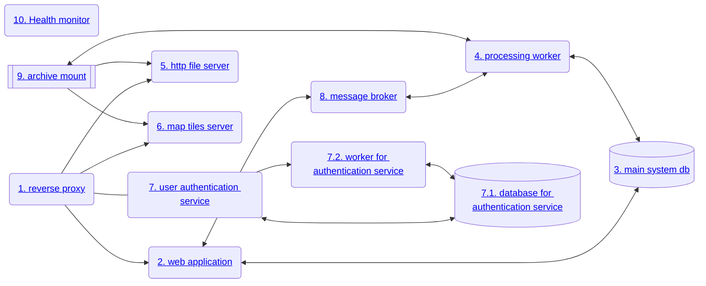

# Administração do sistema

<span class="no-pdf">
    [ :material-file-pdf-box: Descarregar versão PDF](assets/documents/seis-lab-data-administration-guide.pdf){ .md-button .no-pdf }
</span>

Este documento contém um breve guia para auxílio na manutenção operacional do sistema SeisLabData.


## Ambiente de produção

O sistema SeisLabData está disponível dentro da rede interna do IPMA. O seu ponto de
entrada principal para os utilizadores é através do URL:

<https://seis-lab-data.ipma.pt>

O domínio `seis-lab-data.ipma.pt` corresponde à máquina com IP interno `193.137.20.17`. Esta
máquina tem as seguintes especificações:

| Propriedade | Valor |
| -------- | ----- |
| Tipo | Máquina virtual VMware |
| Processadores | 6 núcleos Intel Xeon @2.30GHz |
| RAM | 30 GB |
| Armazenamento | - 380 GB disponíveis no diretório `/home`<br><br> - 6 TB disponíveis no diretório `/mnt/seislab_swap` |
| Sistema Operativo | Ubuntu 24.04.3 LTS |


### Estrutura de ficheiros no servidor

O sistema é composto principalmente por ficheiros localizados no diretório `/opt/seis-lab-data`, com a seguinte estrutura:

```
/opt/seis-lab-data/
├── secrets/                           # credenciais e outros dados secretos do sistema
├── certs/                             # Certificados TLS
├── keys/                              # Chaves privadas TLS
├── Caddyfile                          # Configuração da componente servidor web
├── compose-deployment.env             # Variáveis de ambiente do docker compose
├── compose.prod-env.yaml              # Stack docker compose
├── image-url.env                      # URL da imagem docker a utilizar para instalar o sistema
├── sld-auth-blueprint-prod-env.yaml   # Configuração do serviço de autenticação
├── traefik-prod-config.toml           # Configuração da componente reverse-proxy
└── traefik-tls-config.toml            # Configuração TLS da componente reverse-proxy
```

Os conjuntos de dados estão armazenados nos pontos de montagem do arquivo:

- `/mnt/seislab_data` - Acesso de leitura ao arquivo
- `/mnt/seislab_swap` - Área de escrita para armazenar ficheiros produzidos pelo sistema


### Certificados TLS

Os certificados TLS são geridos externamente e colocados manualmente nos diretórios:

- `/opt/seis-lab-data/certs/` - certificados
- `/opt/seis-lab-data/keys/` - chaves privadas

Os caminhos concretos dos ficheiros estão referenciados no ficheiro de configuração da componente
reverse-proxy (`traefik-tls-config.toml`).


### Variáveis de ambiente

O arranque do sistema requer a presença de algumas variáveis de ambiente. Estas estão definidas em dois
ficheiros. O ficheiro `compose-deployment.env` é editado manualmente e contém as seguintes variáveis:

| Variável                              | Descrição                                                           |
|---------------------------------------|---------------------------------------------------------------------|
| `DEBUG`                               | Modo de depuração (`true`/`false`) - Deve normalmente estar definido como `false`). Pode ser definido como `true` se necessário, para fins de depuração, mas note-se que o modo de depuração pode afetar o desempenho do sistema. |
| `LOG_CONFIG_FILE`                     | Caminho para o ficheiro de configuração de _logs_. Se necessário, este ficheiro pode ser editado de modo a obter uma saída de _logs_ mais detalhada, para fins de depuração. Note-se que _logging_ detalhado pode afetar o desempenho do sistema. |
| `AUTH_AUTHENTIK_BOOTSTRAP_PASSWORD`   | Palavra-passe inicial da componente [user authentication service]   |
| `AUTH_AUTHENTIK_BOOTSTRAP_TOKEN`      | Token inicial da componente [user authentication service]          |
| `AUTH_AUTHENTIK_BOOTSTRAP_EMAIL`      | Email inicial da componente [user authentication service]           |

O ficheiro `image-url.env` é reescrito de cada vez que é realizada uma instalação automatizada do
sistema. Como tal, não deve ser editado manualmente. Contém uma única variável:

- `IMAGE_URL` - a imagem docker a utilizar nas componentes
  [web application](#2-componente-web-application) e [processing worker](#4-componente-processing-worker)

Existem muitas outras variáveis de ambiente que podem ser usadas para configurar o sistema. Estas são
indicadas na secção relevante do ficheiro docker compose `compose.prod-env.yaml`. Este ficheiro está
configurado de forma apropriada para o ambiente de produção, pelo que em condições normais não será
necessário modificá-lo.


### Acesso externo

O acesso externo ao ambiente de produção é uma operação altamente privilegiada e deve ser restrito
aos administradores do sistema. O único acesso adicional necessário é o da equipa de desenvolvimento,
para fins de configuração inicial e posterior instalação de novas versões do sistema.

O acesso é feito exclusivamente por SSH com autenticação por chave pública, e o tráfego flui apenas
a partir do endereço IP de uma máquina previamente autorizada.


!!! NOTE "Acesso da equipa de desenvolvimento"

    Para fins de teste e depuração, os membros da equipa de desenvolvimento que necessitem de aceder
    à interface web do sistema podem abrir uma ligação SSH com proxy SOCKS:

    ```shell
    ssh seis-lab-data-production -N -D 1080
    ```

    E depois usar um navegador web com suporte de proxy. Por exemplo, o Google Chrome:

    ```shell
    google-chrome --proxy-server="socks5://localhost:1080
    ```

    Com esta ligação ativa, o ambiente de produção pode ser acedido navegando para

    <https://seis-lab-data.ipma.pt>


## Operações de manutenção

O sistema é orquestrado com o [docker compose], que por sua vez é gerido pelo [systemd]. Isto significa que:

[docker compose]: https://docs.docker.com/compose/
[systemd]: https://systemd.io/

- O serviço docker é gerido pelo systemd, que se encarrega de iniciar/parar os serviços do sistema
  operativo de forma automatizada. Em caso de reinício da máquina, o docker recupera de forma autónoma.

- O arranque/paragem do sistema é gerido pelo docker compose. O ficheiro `compose.prod-env.yaml` contém
  instruções para reiniciar automaticamente todos os serviços do sistema. Isto significa que em caso de
  a máquina ser reiniciada, o sistema recupera de forma autónoma.


### Iniciar e parar o sistema manualmente

Conforme indicado anteriormente, o sistema está configurado para se manter em operação contínua,
inclusive sobrevivendo a _reboots_ da máquina. Ainda assim, se necessário, é possível geri-lo
manualmente.

Iniciar todos os serviços:

```bash
cd /opt/seis-lab-data
docker compose \
    -f compose.prod-env.yaml \
    --env-file compose-deployment.env \
    --env-file image-url.env \
    up -d
```

Parar todos os serviços:

```bash
docker compose \
    -f compose.prod-env.yaml \
    --env-file compose-deployment.env \
    --env-file image-url.env \
    down
```

!!! WARNING
    O comando `down` não remove os volumes persistentes (bases de dados). Para remover todos os
    dados persistentes, adicionar a opção `--volumes`. Isto irá apagar os volumes docker, pelo que
    deve assegurar a existência de uma estratégia de _backup_ adequada antes de utilizar esta opção.

Para reiniciar um serviço individual:

```shell
docker compose -f compose.prod-env.yaml restart <nome-do-serviço>
```


### Monitorização dos serviços docker

**Via interface web (Dozzle):**

Aceder a `https://seis-lab-data.ipma.pt/monitoring` com uma conta Authentik válida.

**Via linha de comandos:**

```shell
# Logs de um serviço específico
docker compose -f compose.prod-env.yaml logs -f webapp

# Logs de todos os serviços, vendo só o output que
# foi gerado nos últimos 10 minutos
docker compose -f compose.prod-env.yaml logs -f --since 10m
```

Os logs são geridos pelo systemd, pelo que também é possível usar o comando `journalctl`
para inspecção:

```shell
sudo journalctl ...
```


## Componentes do sistema

O sistema SeisLabData é composto pelos seguintes componentes:

<span class="no-pdf">

```mermaid
flowchart LR
    monitor(<a href="#10-componente-health-monitor">10. Health monitor</a>)
    rev-proxy(<a href="#1-componente-reverse-proxy">1. reverse proxy</a>)
    webapp(<a href="#2-componente-web-application">2. web application</a>)
    db[(<a href="#3-componente-main-system-db">3. main system db</a>)]
    proc-worker(<a href="#4-componente-processing-worker">4. processing worker</a>)
    file-server(<a href="#5-componente-http-file-server">5. http file server</a>)
    tile-server(<a href="#6-componente-map-tiles-server">6. map tiles server</a>)
    auth-webapp(<a href="#7-componente-user-authentication-service">7. user authentication service</a>)
    auth-db[(<a href="#71-componente-database-for-authentication-service">7.1. database for authentication service</a>)]
    auth-worker(<a href="#72-componente-worker-for-authentication-service">7.2. worker for authentication service</a>)
    message-broker(<a href="#8-componente-message-broker">8. message broker</a>)
    arch[[<a href="#9-componente-archive-mount">9. archive mount</a>]]
    rev-proxy --> webapp
    rev-proxy --> file-server
    rev-proxy --> tile-server
    rev-proxy --- auth-webapp
    auth-webapp <--> auth-db
    auth-webapp --> auth-worker
    auth-worker <--> auth-db
    webapp <--> db
    proc-worker <--> db
    webapp <--> message-broker
    message-broker <--> proc-worker
    arch --> file-server
    arch --> tile-server
    arch <--> proc-worker
```
</span>

#### 1. Componente `reverse proxy`

Este componente é uma instância [Traefik](https://doc.traefik.io/traefik/). Recebe pedidos HTTP
e direciona-os para o serviço adequado, de acordo com as regras descritas na tabela:

| Regra de encaminhamento                               | Serviço de destino              |
|-------------------------------------------------------|---------------------------------|
| host: `seis-lab-data.ipma.pt`                         | `web application`               |
| host: `auth.seis-lab-data.ipma.pt`                    | `user authentication service`   |
| host: `data.seis-lab-data.ipma.pt`                    | `http file server`              |
| host: `seis-lab-data.ipma.pt`<br> path: `/tiles`      | `map tiles server`              |
| host: `seis-lab-data.ipma.pt`<br> path: `/monitoring` | `log viewer`                    |


##### Ficheiros de configuração relevantes

- `traefik-prod-config.toml` - configuração estática do Traefik
- `traefik-tls-config.toml` - ficheiro que indica a localização dos certificados TLS
- `compose.prod-env.yaml` - as configurações dinâmicas do Traefik são definidas sob a forma
  de _labels_ Docker neste ficheiro


#### 2. Componente `web application`

Esta é a componente principal do sistema, implementada em Python. Consiste numa aplicação web
que serve a interface gráfica e a API que permite interagir com o catálogo.


##### Ficheiros de configuração relevantes

- `compose.prod-env.yaml` - serviço `webapp`; a configuração é feita via variáveis de ambiente
- `secrets/sld-database-dsn` - credenciais de acesso à base de dados principal
- `secrets/auth-client-id` e `secrets/auth-client-secret` - credenciais de acesso ao serviço de autenticação


#### 3. Componente `main system db`

Instância [PostgreSQL](https://www.postgresql.org/) com a extensão PostGIS. Armazena os registos
de catálogo do sistema.


##### Ficheiros de configuração relevantes

- `compose.prod-env.yaml` - serviço `db`
-


##### Aceder à base de dados

O ficheiro `compose.prod-env.yaml` não publica nenhuma porta do serviço docker da base de dados. Isto
significa que só é possível aceder à base de dados através da máquina onde está instalado o sistema.

O acesso pode ser feito com o comando:

```bash
docker compose \
    -f compose.prod-env.yaml \
    --env-file compose-deployment.env \
    --env-file image-url.env \
    exec db psql -U sld -d seis_lab_data
```


#### 4. Componente `processing worker`

Aplicação [Dramatiq](https://dramatiq.io/) que executa tarefas em segundo plano, nomeadamente a
criação e processamento de registos no sistema. Comunica com a aplicação web através do
`message broker`.


#### 5. Componente `http file server`

Instância [Caddy](https://caddyserver.com/) que serve os ficheiros do arquivo de dados em
`data.seis-lab-data.ipma.pt`. O acesso é controlado pelo serviço de autenticação via
_forward authentication_ do Traefik.


##### Ficheiros de configuração relevantes

- `Caddyfile` - configuração do servidor Caddy
- `compose.prod-env.yaml` - serviço `caddy-file-server`


#### 6. Componente `map tiles server`

Instância [Martin](https://martin.maplibre.org/) que serve _map tiles_ vetoriais a partir da
base de dados PostGIS e de ficheiros PMTiles. Acessível sob o caminho `/tiles` do domínio
principal.


##### Ficheiros de configuração relevantes

- O ficheiro de configuração do Martin é mantido como _Docker secret_ em
  `/opt/seis-lab-data/secrets/martin-config.yaml`


#### 7. Componente `user authentication service`

Instância [Authentik](https://goauthentik.io/) que gere a autenticação e autorização dos
utilizadores via OIDC/OAuth2. Acessível em `auth.seis-lab-data.ipma.pt`. O sistema define dois
grupos de utilizadores:

- `seis-lab-data-editors` - utilizadores com permissão de edição de registos
- `seis-lab-data-catalog-admins` - administradores do catálogo

A gestão de utilizadores (criação de contas, atribuição a grupos, reposição de palavras-passe)
é feita através do painel de administração do Authentik, acessível em
`auth.seis-lab-data.ipma.pt/if/admin/`.


##### Ficheiros de configuração relevantes

- `sld-auth-blueprint-prod-env.yaml` - _blueprint_ de configuração inicial do Authentik
- Segredos relevantes: `auth-secret-key`, `auth-client-id`, `auth-client-secret`,
  `auth-db-password`, `auth-email-username`, `auth-email-password`


#### 7.1. Componente `database for authentication service`

Instância PostgreSQL dedicada ao Authentik. Não é partilhada com a base de dados principal
do sistema.


#### 7.2. Componente `worker for authentication service`

Componente _worker_ do Authentik, responsável por tarefas em segundo plano como o envio de
emails e a aplicação de _blueprints_.


#### 8. Componente `message broker`

Instância [Redis](https://redis.io/) utilizada como fila de mensagens entre a `web application`
e o `processing worker`.


#### 9. Componente `archive mount`

Esta componente consiste nos volumes que montam o sistema de ficheiros do arquivo no nó que
contém a instalação.

| Ponto de montagem no servidor | Propósito                                                                                                                  |
|-------------------------------|----------------------------------------------------------------------------------------------------------------------------|
| `/mnt/seislab_data`           | Permite ao sistema aceder aos conjuntos de dados que estão no arquivo do IPMA — este _mount_ é só de leitura.             |
| `/mnt/seislab_swap`           | _Mount_ com acesso de escrita. Este espaço é utilizado pelo sistema para armazenar informação gerada pelo próprio.         |

Estes volumes são posteriormente montados dentro dos contentores docker relevantes, de modo a que
possam ser utilizados pelos serviços do sistema:

- [4. Componente `processing worker`](#4-componente-processing-worker)
- [5. Componente `http file server`](#5-componente-http-file-server)
- [6. Componente `map tiles server`](#6-componente-map-tiles-server)


#### 10. Componente `health monitor`

Instância [Dozzle](https://dozzle.dev/) que permite visualizar os _logs_ de todos os serviços em
tempo real, através de uma interface web. Acessível em `seis-lab-data.ipma.pt/monitoring`. O acesso
é protegido pelo serviço de autenticação.


## Implementação de novas versões do sistema

As novas versões do sistema são implementadas através de um fluxo de trabalho semi-automatizado.
Quando uma nova versão do sistema é considerada pronta para produção, um membro da equipa de
desenvolvimento cria manualmente uma tag git e envia-a para o repositório de código-fonte. Isto
desencadeia uma sequência de procedimentos automatizados que culmina com a implementação da nova
versão. A sequência é a seguinte:

1.  Um membro da equipa de desenvolvimento cria uma tag git com o padrão de nomenclatura `vX.Y.Z`
    e envia-a para o repositório central de código-fonte alojado no GitHub

2.  Quando a tag git é enviada, o fluxo de trabalho em `.github/workflows.ci.yaml` é executado,
    realizando os seguintes passos:

    1.  Realizar análise estática do código para verificar erros

    2.  Formatar o código de acordo com as normas de estilo

    3.  Construir uma imagem docker com o código — este é o artefacto que será finalmente
        implementado

    4.  Executar vários testes usando a imagem docker construída — incluindo testes unitários,
        de integração e de ponta a ponta

    5.  Publicar a imagem docker construída no registo docker do repositório

    6.  Invocar o fluxo de trabalho `.github/workflows/deployment-initiator.yml`, que envia um
        webhook para a máquina de implementação da equipa de desenvolvimento, notificando que uma
        nova versão está pronta para ser implementada

3.  A máquina de implementação executa a ferramenta [woodpecker CI] para gerir as implementações.
    Esta ferramenta recebe a notificação do webhook e utiliza as instruções presentes no ficheiro
    `.woodpecker/deployment.yaml` para gerir a implementação.

    Note-se que o repositório de código-fonte alojado no GitHub não tem permissão para aceder ao
    ambiente de produção do IPMA — o acesso é sempre feito através da máquina de implementação,
    que é totalmente controlada e gerida pela equipa de desenvolvimento.

4.  A máquina de implementação inicia então o seguinte fluxo de trabalho:

    1.  Validar o webhook do GitHub
    2.  Ligar ao ambiente de produção via SSH
    3.  Atualizar os ficheiros de configuração relevantes
    4.  Fazer _pull_ da imagem docker do sistema previamente construída a partir do registo docker
    5.  Reiniciar o stack docker compose
    6.  Enviar uma notificação à equipa de desenvolvimento quando a implementação estiver concluída


### Realizar implementações manuais

O fluxo de trabalho preferido para implementação é o procedimento semi-automatizado descrito acima.
É também possível realizar implementações manuais:

1.  Criar uma tag git com o padrão de nomenclatura `vX.Y.Z` e enviá-la para o repositório
    central de código-fonte alojado no GitHub

2.  Editar o ficheiro `/opt/seis-lab-data/image-url.env` e atualizar `IMAGE_URL` para a nova
    versão da imagem.

3.  Realizar a implementação:

```bash
docker compose \
    -f compose.prod-env.yaml \
    --env-file compose-deployment.env \
    --env-file image-url.env \
    up -d --force-recreate webapp processing-worker
```

4. Se a nova versão incluir migrações de base de dados, executar após o passo anterior:

```bash
docker compose \
    -f compose.prod-env.yaml \
    --env-file compose-deployment.env \
    --env-file image-url.env \
    exec webapp uv run seis-lab-data db upgrade
```

[woodpecker CI]: https://woodpecker-ci.org/
