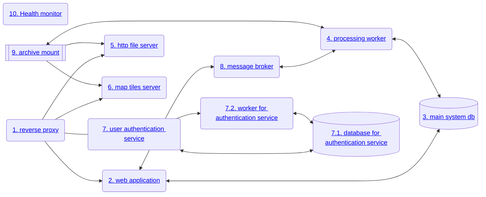

# Administração do sistema

<span class="no-pdf">
    [ :material-file-pdf-box: Descarregar versão PDF](assets/documents/seis-lab-data-administration-guide.pdf){ .md-button .no-pdf }
</span>

Este documento contem um breve guia para auxílio na manutenção do sistema SeisLabData.


## Ambiente de produção

O sistema SeisLabData está disponível dentro da rede interna do IPMA. O seu ponto de
entrada para os utilizadores é através do URL:

<https://seis-lab-data.ipma.pt>

O domínio `seis-lab-data.ipma.pt` corresponde à máquina com IP interno `????.????.?.?`. Esta máquina tem
como características:

- processadores:
- memória RAM:
- memória ROM:
- sistema operativo:

O sistema é orquestrado usando Docker Compose(<https://docs.docker.com/compose/>).


### Estrutura de ficheiros no servidor

```
/opt/seis-lab-data/
├── secrets/                           # credenciais e outros dados secretos do sistema
├── certs/                             # Certificados TLS
├── keys/                              # Chaves privadas TLS
├── Caddyfile                          # Configuração da componente
├── compose-deployment.env             # Variáveis de ambiente do docker compose
├── compose.prod-env.yaml              # Stack docker compose
├── image-url.env                      # Variáveis de ambiente do docker compose
├── sld-auth-blueprint-prod-env.yaml   # Configuração do serviço de autenticação
├── traefik-prod-config.toml           # Configuração da componente reverse-proxy
└── traefik-tls-config.toml            # Configuração TLS da componente reverse-proxy

/mnt/seislab_data/           # Arquivo de dados (acesso só de leitura)
/mnt/seislab_swap/           # área para escrita de ficheiros
```


### Certificados TLS

Os certificados TLS são geridos externamente e colocados manualmente nos diretórios:

- `/opt/seis-lab-data/certs/` - certificados
- `/opt/seis-lab-data/keys/` - chaves privadas

Os caminhos concretos dos ficheiros são usados no ficheiro `traefik-tls-config.toml`.


### Variáveis de ambiente

O arranque do sistema requer a presença de algumas variáveis de ambiente. Estas estão definidas em dois
ficheiros. O ficheiro `compose-deployment.env` é editado manualmente e contem as seguintes variáveis.

| Variável                              | Descrição                                                         |
|---------------------------------------|-------------------------------------------------------------------|
| `DEBUG`                               | Modo de depuração (`true`/`false`, normalmente `false`)           |
| `LOG_CONFIG_FILE`                     | Caminho para o ficheiro de configuração de _logs_                 |
| `AUTH_AUTHENTIK_BOOTSTRAP_PASSWORD`   | Palavra-passe inicial da componente [user authentication service] |
| `AUTH_AUTHENTIK_BOOTSTRAP_TOKEN`      | Token inicial da componente [user authentication service]         |
| `AUTH_AUTHENTIK_BOOTSTRAP_EMAIL`      | Email inicial da componente [user authentication service]         |

O ficheiro `image-url.env` é rescrito de cada vez que é feita uma instalação automatizada do sistema.
Como tal, não deve ser manualmente editado. Contem uma única variável:

- `IMAGE_URL` - imagem docker que deve ser usada nas componentes
  [web application](#2-componente-web-application) e [processing worker](#4-componente-processing-worker)

Existem muitas outras variáveis de ambiente que podem ser usadas para configurar o sistema. Estas são indicadas
na secção relevante do ficheiro docker compose `compose.prod-env.yaml`. Este ficheiro está configurado de forma
apropriada para o ambiente de produção, pelo que em condições normais não será necessário modificá-lo.


## Operações de manutenção

O sistema é gerido com o docker compose (), que por sua vez é gerido pelo systemd (). Isto significa que:

- o arranque/paragem do docker é gerido pelo systemd. O systemd encarrega-se de iniciar/parar serviços
  do Sistema Operativo de forma automatizada. Isto significa que em caso de a máquina ser reiniciada o
  docker recupera de forma autónoma

- o arranque/paragem do sistema é gerido pelo docker compose. O ficheiro `compose.prod-env.yaml` contem
  instruções para reiniciar automáticamente todos os serviços do sistema. Isto significa que em caso
  de a máquina ser reiniciada, o sistema recupera de forma autónoma.


### Iniciar e parar o sistema manualmente

Conforme indicado anteriormente, o sistema está configurado para se manter em operações de forma
contínua, inclusive sobrevivendo a _reboots_ da máquina. Ainda assim, se necessário, é possível
geri-lo manualmente.

Iniciar todos os serviços:

```bash
cd /opt/seis-lab-data
docker compose \
    -f compose.prod-env.yaml \
    --env-file compose-deployment.env \
    --env-file image-url.env \
    up -d
```

Parar todos os serviços:

```bash
docker compose -f compose.prod-env.yaml down
```

!!! WARNING
    O comando `down` não remove os volumes persistentes (bases de dados). Para remover
    todos os dados persistentes, adicionar a opção `--volumes`.

Para reiniciar um serviço individual:

```shell
docker compose -f compose.prod-env.yaml restart <nome-do-serviço>
```


### Monitorização dos serviços docker

**Via interface web (Dozzle):**

Aceder a `https://seis-lab-data.ipma.pt/moniotring` com uma conta Authentik válida.

**Via linha de comandos:**

```shell
# Logs de um serviço específico
docker compose -f compose.prod-env.yaml logs -f webapp

# Logs de todos os serviços, vendo só o output que
# foi gerado nos últimos 10 minutos
docker compose -f compose.prod-env.yaml logs -f --since 10m
```

Os logs são geridos pelo systemd, pelo que também é possível usar o comando `journalctl`
para a sua inspecção:

```shell
sudo journalctl ...
```


## Componentes do sistema

O sistema SeisLabData é composto pelos seguintes componentes:

<span class="no-pdf">

```mermaid
flowchart LR
    monitor(<a href="#10-servico-health-monitor">10. Health monitor</a>)
    rev-proxy(<a href="#1-componente-reverse-proxy">1. reverse proxy</a>)
    webapp(<a href="#2-componente-web-application">2. web application</a>)
    db[(<a href="#3-componente-main-system-db">3. main system db</a>)]
    proc-worker(<a href="#4-componente-processing-worker">4. processing worker</a>)
    file-server(<a href="#5-componente-http-file-server">5. http file server</a>)
    tile-server(<a href="#6-componente-map-tiles-server">6. map tiles server</a>)
    auth-webapp(<a href="#7-componente-user-authentication-service">7. user authentication service</a>)
    auth-db[(<a href="#71-componente-database-for-authentication-service">7.1. database for authentication service</a>)]
    auth-worker(<a href="#72-componente-worker-for-authentication-service">7.2. worker for authentication service</a>)
    message-broker(<a href="#8-componente-message-broker">8. message broker</a>)
    arch[[<a href="#9-componente-archive-mount">9. archive mount</a>]]
    rev-proxy --> webapp
    rev-proxy --> file-server
    rev-proxy --> tile-server
    rev-proxy --- auth-webapp
    auth-webapp <--> auth-db
    auth-webapp --> auth-worker
    auth-worker <--> auth-db
    webapp <--> db
    proc-worker <--> db
    webapp <--> message-broker
    message-broker <--> proc-worker
    arch --> file-server
    arch --> tile-server
    arch <--> proc-worker
```
</span>

#### 1. Componente `reverse proxy`

Este componente é uma instância traefik. Recebe pedidos HTTP e direciona-os para o serviço
adequado, de acordo com as regras descritas na tabela:

| Regra de encaminhamento                               | Serviço de destino              |
|-------------------------------------------------------|---------------------------------|
| host: `seis-lab-data.ipma.pt`                         | `web application`               |
| host: `auth.seis-lab-data.ipma.pt`                    | `user authentication service`   |
| host: `data.seis-lab-data.ipma.pt`                    | `http file server`              |
| host: `seis-lab-data.ipma.pt`<br> path: `/tiles`      | `map tiles server`              |
| host: `seis-lab-data.ipma.pt`<br> path: `/monitoring` | `log viewer`                    |


##### Ficheiros de configuração relevantes

- `traefik-prod-config.toml` - configuração estática do Traefik
- `traefik-tls-config.toml` - ficheiro que indica a localização dos certificados TLS
- `compose.prod-env.yaml` - as configurações dinâmicas do Traefik são definidas sob a forma
  de _labels_ Docker neste ficheiro

Mais informação disponível em: <https://doc.traefik.io/traefik/>


#### 2. Componente `web application`

Esta é a componente principal do sistema, implementada em Python. Consiste numa
aplicação web que serve a interface gráfica a a API que permite interagir com o catálogo.


##### Ficheiros de configuração relevantes

- `compose.prod-env.yaml` - serviço `webapp`; a configuração é feita via variáveis de ambiente
- `sld-database-dsn` - credenciais de acesso à base de dados principal
- `secrets/auth-client-id` e `secrets/auth-client-secret` - credenciais de acesso ao serviço de autenticação


#### 3. Componente `main system db`

Instância [PostgreSQL](https://www.postgresql.org/) com a extensão PostGIS (). Armazena os registos de
catálogo do sistema.


##### Ficheiros de configuração relevantes

- `compose.prod-env.yaml` - serviço `db`;
-


##### Aceder à base de dados

O ficheiro `compose.prod-env.yaml` não publica nenhuma porta do serviço docker da base dedados. Isto
significa que só é possível aceder à base de dados através da máquina onde está instalado o sistema.

O acesso pode ser feito com o comando:

```bash
docker compose
    -f compose.prod-env.yaml
    --env-file compose-deployment.env
    --env-file image-url.env
    exec db psql -U sld -d seis_lab_data
```


#### 4. Componente `processing worker`

Aplicação [Dramatiq] que executa tarefas em segundo plano, nomeadamente a criação e processamento
de registos no sistema. Comunica com a aplicação web através do `message broker`.

[Dramatiq]: https://dramatiq.io/


#### 5. Componente `http file server`

Instância [Caddy] que serve os ficheiros do arquivo de dados em `data.seis-lab-data.ipma.pt`.
O acesso é controlado pelo serviço de autenticação via _forward authentication_ do Traefik.

[Caddy]: https://caddyserver.com/


##### Ficheiros de configuração relevantes

- `Caddyfile` - configuração do servidor Caddy
- `compose.prod-env.yaml` - serviço `caddy-file-server`


#### 6. Componente `map tiles server`

Instância [Martin] que serve _map tiles_ vetoriais a partir da base de dados PostGIS e de
ficheiros PMTiles. Acessível sob o caminho `/tiles` do domínio principal.

[Martin]: https://martin.maplibre.org/


##### Ficheiros de configuração relevantes

- O ficheiro de configuração do Martin é mantido como _Docker secret_ em
  `/opt/seis-lab-data/secrets/martin-config.yaml`


#### 7. Componente `user authentication service`

Instância [Authentik] que gere a autenticação e autorização dos utilizadores via OIDC/OAuth2.
Acessível em `auth.seis-lab-data.ipma.pt`. O sistema define dois grupos de utilizadores:

- `seis-lab-data-editors` - utilizadores com permissão de edição de registos
- `seis-lab-data-catalog-admins` - administradores do catálogo

A gestão de utilizadores (criação de contas, atribuição a grupos, reposição de palavras-passe)
é feita através do painel de administração do Authentik, acessível em
`auth.seis-lab-data.ipma.pt/if/admin/`.

[Authentik]: https://goauthentik.io/


##### Ficheiros de configuração relevantes

- `sld-auth-blueprint-prod-env.yaml` - _blueprint_ de configuração inicial do Authentik
- Segredos relevantes: `auth-secret-key`, `auth-client-id`, `auth-client-secret`,
  `auth-db-password`, `auth-email-username`, `auth-email-password`


#### 7.1. Componente `database for authentication service`

Instância PostgreSQL dedicada ao Authentik. Não é partilhada com a base de dados principal
do sistema.


#### 7.2. Componente `worker for authentication service`

Componente _worker_ do Authentik, responsável por tarefas em segundo plano como o envio de
emails e a aplicação de _blueprints_.


#### 8. Componente `message broker`

Instância [Redis] utilizada como fila de mensagens entre a `web application` e o
`processing worker`.

[Redis]: https://redis.io/


#### 9. Componente `archive mount`

Esta componente do sistema consiste nos volumes que montam o sistema de ficheiros
do arquivo no nó que contem a instalação.

| Ponto de montagem no servidor | Propósito                                                                                                                  |
|-------------------------------|----------------------------------------------------------------------------------------------------------------------------|
| `/mnt/seislab_data`           | Permite ao sistema aceder aos conjuntos de dados que estão no arquivo do IPMA - este _mount_ só permite acesso de leitura. |
| `/mnt/seislab_swap`           | _Mount_ com acesso de escrita. Este espaço é utilizado pelo sistema para armazenar informação gerada pelo próprio.         |

Estes volumes são posteriormente montados dentro dos contentores docker relevantes, de modo a que possam ser
utilizados pelos serviços do sistema:

- [4. Serviço `processing worker`](#4-serviço-processing-worker)
- [5. Serviço `http file server`](#5-serviço-http-file-server)
- [6. Serviço `map tiles server`](#6-serviço-map-tiles-server)


#### 10. Componente `health monitor`

Instância [Dozzle] que permite visualizar os _logs_ de todos os serviços em tempo real, através
de uma interface web. Acessível em `seis-lab-data.ipma.pt/monitoring`. O acesso é protegido pelo
serviço de autenticação.

[Dozzle]: https://dozzle.dev/


### seis-lab-data CLI tool

A aplicação inclui uma ferramenta de linha de comandos, acessível dentro do contentor `webapp`:

```bash
docker compose -f compose.prod-env.yaml exec webapp seis-lab-data --help
```

Comandos disponíveis:

| Comando                               | Descrição                                            |
|---------------------------------------|------------------------------------------------------|
| `seis-lab-data db upgrade`            | Executa migrações de base de dados pendentes         |
| `seis-lab-data bootstrap all`         | Inicializa os dados base do sistema                  |
| `seis-lab-data run-web-server`        | Inicia o servidor web (invocado pelo Docker)         |
| `seis-lab-data run-processing-worker` | Inicia o _worker_ de processamento (invocado pelo Docker) |


### Atualizar a aplicação

1. Editar o ficheiro `.env` e atualizar `IMAGE_URL` para a nova versão da imagem
2. Aplicar a atualização:

```bash
docker compose -f compose.prod-env.yaml --env-file .env up -d webapp processing-worker
```

3. Se a nova versão incluir migrações de base de dados, executar após o passo anterior:

```bash
docker compose -f compose.prod-env.yaml exec webapp seis-lab-data db upgrade
```
