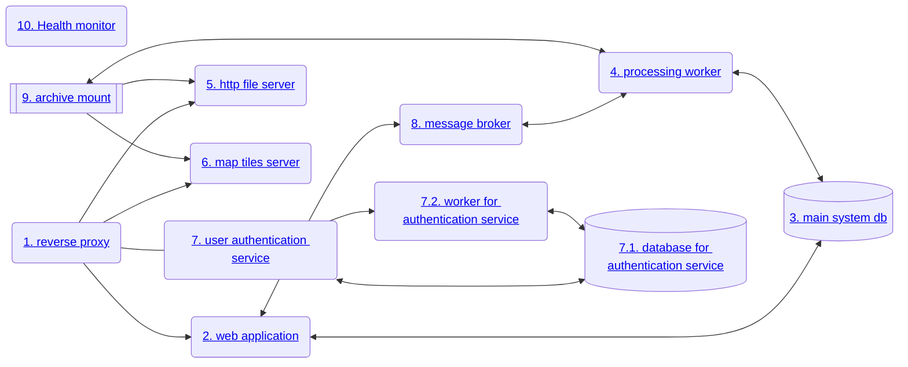

# Guia de administração do sistema

<span class="no-pdf">
    [ :material-file-pdf-box: Descarregar versão PDF](assets/documents/seis-lab-data-administration-guide.pdf){ .md-button .no-pdf }
</span>

Este documento é o entregável de projeto _D07 - Guia de instalação orientado ao administrador de sistemas_. Contém informação sobre o sistema SeisLabData instalado no ambiente de produção do IPMA e um breve guia para a sua manutenção operacional.


## Ambiente de produção

O sistema SeisLabData está disponível dentro da rede interna do IPMA. O seu ponto de
entrada principal para os utilizadores é através do URL:

<https://seis-lab-data.ipma.pt>

O domínio `seis-lab-data.ipma.pt` corresponde à máquina com IP interno `193.137.20.17`. Esta
máquina tem as seguintes especificações:

| Propriedade | Valor |
| -------- | ----- |
| Tipo | Máquina virtual VMware |
| Processadores | 6 núcleos Intel Xeon @2.30GHz |
| RAM | 30 GB |
| Armazenamento | - 380 GB disponíveis no diretório `/home`<br><br> - 6 TB disponíveis no diretório `/mnt/seislab_swap` |
| Sistema Operativo | Ubuntu 24.04.3 LTS |


### Ficheiros e diretórios relevantes do sistema

Existem quatro conjuntos principais de ficheiros relacionados com o sistema SeisLabData:

1.  **Ficheiros de configuração e instalação** - A configuração do sistema é principalmente composta por ficheiros
    localizados no diretório `/opt/seis-lab-data`, com a seguinte estrutura:

    ```
    /opt/seis-lab-data/
    ├── secrets/                           # credenciais e outros dados secretos do sistema
    ├── certs/                             # Certificados TLS
    ├── keys/                              # Chaves privadas TLS
    ├── Caddyfile                          # Configuração da componente servidor web
    ├── compose-deployment.env             # Variáveis de ambiente do docker compose
    ├── compose.prod-env.yaml              # Stack docker compose
    ├── image-url.env                      # URL da imagem docker a utilizar para instalar o sistema
    ├── sld-auth-blueprint-prod-env.yaml   # Configuração do serviço de autenticação
    ├── traefik-prod-config.toml           # Configuração da componente reverse-proxy
    └── traefik-tls-config.toml            # Configuração TLS da componente reverse-proxy
    ```

2.  **Artefactos de código** - O sistema é instalado como um conjunto de imagens docker, orquestradas via docker
    compose. Estas imagens estão armazenadas no diretório `/var/lib/docker`.

3.  **Conjuntos de dados marinhos auxiliares gerados pelo sistema** - Todos os conjuntos de dados auxiliares
    utilizados pelo sistema estão armazenados numa partição de leitura-escrita do arquivo, montada no diretório
    `/mnt/seislab_swap`.

4.  **Conjuntos de dados marinhos arquivados que são indexados e apresentados no catálogo principal do sistema** -
    A maior parte dos dados do arquivo marino geosísmico do IPMA está montada como uma partição só de leitura no
    diretório `/mnt/seislab_data`.


### Variáveis de ambiente

O arranque do sistema requer a presença de algumas variáveis de ambiente. Estas estão definidas em dois ficheiros:

1.  `compose-deployment.env` - Este ficheiro é editado manualmente e contém as seguintes variáveis:

    | Variável                              | Descrição                                                           |
    |---------------------------------------|---------------------------------------------------------------------|
    | `DEBUG`                               | Modo de depuração (`true`/`false`) - Deve normalmente estar definido como `false`). Pode ser definido como `true` se necessário, para fins de depuração, mas note-se que o modo de depuração pode afetar o desempenho do sistema. |
    | `LOG_CONFIG_FILE`                     | Caminho para o ficheiro de configuração de _logs_. Se necessário, este ficheiro pode ser editado de modo a obter uma saída de _logs_ mais detalhada, para fins de depuração. Note-se que _logging_ detalhado pode afetar o desempenho do sistema. |
    | `AUTH_AUTHENTIK_BOOTSTRAP_PASSWORD`   | Palavra-passe inicial da componente [user authentication service]   |
    | `AUTH_AUTHENTIK_BOOTSTRAP_TOKEN`      | Token inicial da componente [user authentication service]          |
    | `AUTH_AUTHENTIK_BOOTSTRAP_EMAIL`      | Email inicial da componente [user authentication service]           |

2.  `image-url.env` - Este ficheiro é reescrito de cada vez que é realizada uma instalação automatizada do
    sistema. Como tal, não deve ser editado manualmente. Contém uma única variável:

    - `IMAGE_URL` - a imagem docker a utilizar nas componentes
      [web application](#2-componente-web-application) e [processing worker](#4-componente-processing-worker)

Existem muitas outras variáveis de ambiente que podem ser usadas para configurar o sistema. Estas são
indicadas na secção relevante do ficheiro docker compose `compose.prod-env.yaml`. Este ficheiro está
configurado de forma apropriada para o ambiente de produção, pelo que em condições normais não será
necessário modificá-lo.


### Acesso externo

O acesso externo ao ambiente de produção é uma operação altamente privilegiada e deve ser restrito
aos administradores do sistema. O único acesso adicional necessário é o da equipa de desenvolvimento,
para fins de configuração inicial e posterior instalação de novas versões do sistema.

O acesso é feito exclusivamente por SSH com autenticação por chave pública, e o tráfego flui apenas
a partir do endereço IP de uma máquina previamente autorizada.


!!! info "Acesso da equipa de desenvolvimento à interface web"

    Para fins de teste e depuração, os membros da equipa de desenvolvimento que necessitem de aceder
    à interface web do sistema podem abrir uma ligação SSH com proxy SOCKS:

    ```shell
    ssh seis-lab-data-production -N -D 1080
    ```

    E depois usar um navegador web com suporte de proxy. Por exemplo, o Google Chrome:

    ```shell
    google-chrome --proxy-server="socks5://localhost:1080
    ```

    Com esta ligação ativa, o ambiente de produção pode ser acedido navegando para

    <https://seis-lab-data.ipma.pt>


### Certificados TLS

Os serviços web do sistema utilizam certificados TLS. Estes são geridos externamente pela equipa de TI
do IPMA e colocados manualmente nos diretórios:

- `/opt/seis-lab-data/certs/` - certificados
- `/opt/seis-lab-data/keys/` - chaves privadas

Os caminhos concretos dos ficheiros estão referenciados no ficheiro de configuração da componente
reverse-proxy (`traefik-tls-config.toml`).


## Operações de manutenção

O sistema é orquestrado com o [docker compose], que por sua vez é gerido pelo [systemd], o gestor de
serviços padrão no Ubuntu.

[docker compose]: https://docs.docker.com/compose/
[systemd]: https://systemd.io/


### Verificar o estado do serviço docker

O estado dos serviços docker pode ser monitorizado utilizando o utilitário padrão `systemctl`:

```shell
systemctl status docker.service docker.socket
```

O resultado do comando acima deve indicar se os serviços systemd do docker estão **ativos** e **ativados**,
o que significa que o docker está a funcionar e que será reiniciado sempre que a máquina for reiniciada.


### Verificar o estado do sistema SeisLabData

Sendo orquestrado com docker compose, o estado do sistema em execução pode ser verificado com o
comando `docker compose ps`:

```bash
cd /opt/seis-lab-data
docker compose \
    -f compose.prod-env.yaml \
    --env-file compose-deployment.env \
    --env-file image_url.env \
    ps --all \
    --format "table {{.Service}}\t{{.Status}}"
```

Exemplo de resultado:

```shell
SERVICE              STATUS
auth-db              Up 2 weeks (healthy)
auth-webapp          Up 2 weeks (healthy)
auth-worker          Up 2 weeks (healthy)
caddy-file-server    Up 2 weeks
db                   Up 2 weeks (healthy)
dozzle               Up 2 weeks
martin-tile-server   Up 2 weeks (healthy)
message-broker       Up 2 weeks (healthy)
processing-worker    Up 2 weeks
web-gateway          Up 2 weeks
webapp               Up 2 weeks
```

O resultado apresenta uma listagem dos serviços do sistema e o seu estado operacional.

As políticas de reinício podem ser verificadas com o comando `docker inspect` para cada contentor
do sistema:

```shell
docker compose \
    -f compose.prod-env.yaml \
    --env-file compose-deployment.env \
    --env-file image_url.env \
    ps --all --quiet \
    | xargs docker inspect --format '{{.Name}} → restart: {{.HostConfig.RestartPolicy.Name}}'
```

Exemplo de resultado:

```shell
/seis-lab-data-auth-db-1 → restart: unless-stopped
/seis-lab-data-auth-webapp-1 → restart: unless-stopped
/seis-lab-data-auth-worker-1 → restart: unless-stopped
/seis-lab-data-caddy-file-server-1 → restart: unless-stopped
/seis-lab-data-db-1 → restart: unless-stopped
/seis-lab-data-dozzle-1 → restart: unless-stopped
/seis-lab-data-martin-tile-server-1 → restart: unless-stopped
/seis-lab-data-message-broker-1 → restart: unless-stopped
/seis-lab-data-processing-worker-1 → restart: unless-stopped
/seis-lab-data-web-gateway-1 → restart: unless-stopped
/seis-lab-data-webapp-1 → restart: unless-stopped
```

O resultado do comando deve mostrar, para cada serviço, o valor `unless-stopped`, o que significa que
o docker garante que o serviço está em execução salvo se for parado manualmente[^1]. Isto significa que
em caso de reinício da máquina, o systemd garante que o motor docker arranca corretamente, e o docker
garante que o sistema SeisLabData também arranca.

[^1]: Para mais informações, consultar a documentação sobre políticas de reinício do docker compose: <https://docs.docker.com/reference/compose-file/services/#restart>


### Iniciar e parar o sistema manualmente

Conforme indicado anteriormente, o sistema está configurado para se manter em operação contínua,
inclusive sobrevivendo a _reboots_ da máquina. Ainda assim, se necessário, é possível geri-lo
manualmente.


**Iniciar todos os serviços**

```bash
cd /opt/seis-lab-data
docker compose \
    -f compose.prod-env.yaml \
    --env-file compose-deployment.env \
    --env-file image-url.env \
    up -d
```

**Parar todos os serviços**

```bash
docker compose \
    -f compose.prod-env.yaml \
    --env-file compose-deployment.env \
    --env-file image-url.env \
    down
```

!!! warning
    O comando `down` não remove os volumes persistentes (bases de dados). Para remover todos os
    dados persistentes, adicionar a opção `--volumes`. Isto irá apagar os volumes docker, pelo que
    deve assegurar a existência de uma estratégia de _backup_ adequada antes de utilizar esta opção.


**Reiniciar um serviço individual**

Para reiniciar um serviço individual:

```shell
docker compose -f compose.prod-env.yaml restart <nome-do-serviço>
```


### Monitorização dos serviços docker

A monitorização dos _logs_ do sistema pode ser feita através de:

1.  Utilizando o componente `journald` padrão do systemd

    O motor docker está configurado para utilizar o _driver_ de _logging_ `journald`[^5]. Como tal,
    os _logs_ dos vários serviços podem ser consultados através do journald. Por exemplo, os _logs_
    do serviço docker `webapp` da última hora podem ser inspecionados com:

    ```shell
    sudo journalctl -b CONTAINER_NAME=seis-lab-data-webapp-1 --since="1 hour ago"
    ```

    !!! tip "Como encontrar nomes de contentores"

        É possível encontrar os nomes dos contentores através do comando `docker compose ps`:

        ```shell
        docker compose \
            -f compose.prod-env.yaml \
            --env-file compose-deployment.env \
            --env-file image_url.env \
            ps --all \
            --format "table {{.Name}}"
        ```

2.  Utilizando o comando `docker compose logs`

    O docker compose dispõe de um comando `docker compose logs` que também pode ser utilizado para
    monitorizar _logs_. Por exemplo, para consultar os _logs_ simultâneos de todos os serviços a
    partir de cinco minutos atrás e continuar a apresentar _logs_ em tempo real:

    ```shell
    docker compose \
    -f compose.prod-env.yaml \
    --env-file compose-deployment.env \
    --env-file image_url.env \
    logs --since 5m --follow
    ```

3.  Utilizando a componente `health monitor` do sistema, através de um navegador web. Aceder a

    <https://seis-lab-data.ipma.pt/monitoring>

    com uma conta Authentik válida e utilizar a interface gráfica para consultar os _logs_


[^5]: Mais detalhes sobre o _driver_ de _logging_ `journald` do docker: <https://docs.docker.com/engine/logging/drivers/journald/>


## Implementação de novas versões do sistema

As novas versões do sistema são implementadas através de um fluxo de trabalho semi-automatizado.
Quando uma nova versão do sistema é considerada pronta para produção, um membro da equipa de
desenvolvimento cria manualmente uma tag git e envia-a para o repositório de código-fonte.

Exemplos de comandos git:

```shell
# criar tag git com o padrão de nomenclatura esperado vX.Y.Z
git tag --annotate --message='Tagged version 1.0.2' v1.0.2

# enviar a tag recém-criada para o repositório central remoto, aqui denominado upstream
git push upstream v1.0.2
```

Isto desencadeia uma sequência de procedimentos automatizados que culmina com a implementação da nova
versão. A sequência completa é:

1.  Um membro da equipa de desenvolvimento cria uma tag git com o padrão de nomenclatura `vX.Y.Z`
    e envia-a para o repositório central de código-fonte alojado no GitHub

2.  Quando a tag git é enviada, o fluxo de trabalho em `.github/workflows.ci.yaml` é executado,
    realizando os seguintes passos:

    1.  Realizar análise estática do código para verificar erros

    2.  Formatar o código de acordo com as normas de estilo

    3.  Construir uma imagem docker com o código — este é o artefacto que será finalmente
        implementado

    4.  Executar vários testes usando a imagem docker construída — incluindo testes unitários,
        de integração e de ponta a ponta

    5.  Publicar a imagem docker construída no registo docker do repositório. Este registo está
        disponível em:

        <https://github.com/NaturalGIS/seis-lab-data/pkgs/container/seis-lab-data%2Fseis-lab-data>

    6.  Invocar o fluxo de trabalho `.github/workflows/deployment-initiator.yml`, que envia um
        webhook para a máquina de implementação da equipa de desenvolvimento, notificando que uma
        nova versão está pronta para ser implementada

3.  A máquina de implementação executa a ferramenta [woodpecker CI] para gerir as implementações.
    Esta ferramenta recebe a notificação do webhook e utiliza as instruções presentes no ficheiro
    `.woodpecker/deployment.yaml` para gerir a implementação.

    !!! note "O repositório GitHub não pode aceder ao ambiente de produção do IPMA"
        Note-se que o repositório de código-fonte alojado no GitHub não tem permissão para aceder ao
        ambiente de produção do IPMA e não armazena quaisquer credenciais de acesso — o acesso é
        sempre feito através da máquina de implementação, que é totalmente controlada e gerida pela
        equipa de desenvolvimento.

        A ferramenta de implementação da máquina de desenvolvimento é acessível (a utilizadores
        autorizados) em:

        <https://ci.seis-lab-data.naturalgis.pt>

4.  A máquina de implementação inicia então o seguinte fluxo de trabalho:

    1.  Validar o webhook do GitHub
    2.  Ligar ao ambiente de produção via SSH
    3.  Atualizar os ficheiros de configuração relevantes
    4.  Fazer _pull_ da imagem docker do sistema previamente construída a partir do registo docker
    5.  Reiniciar o stack docker compose
    6.  Enviar uma notificação à equipa de desenvolvimento quando a implementação estiver concluída


### Realizar implementações manuais

O fluxo de trabalho preferido para implementação é o procedimento semi-automatizado descrito acima.
É também possível realizar implementações manuais:

1.  Criar uma tag git com o padrão de nomenclatura `vX.Y.Z` e enviá-la para o repositório
    central de código-fonte alojado no GitHub (ver os exemplos de comandos git no início desta secção)

2.  Editar o ficheiro `/opt/seis-lab-data/image-url.env` e atualizar `IMAGE_URL` para a nova
    versão da imagem

3.  Realizar a implementação:

```bash
docker compose \
    -f compose.prod-env.yaml \
    --env-file compose-deployment.env \
    --env-file image-url.env \
    up -d --force-recreate webapp processing-worker
```

4. Se a nova versão incluir migrações de base de dados, executar após o passo anterior:

```bash
docker compose \
    -f compose.prod-env.yaml \
    --env-file compose-deployment.env \
    --env-file image-url.env \
    exec webapp uv run seis-lab-data db upgrade
```

[woodpecker CI]: https://woodpecker-ci.org/


## Componentes do sistema

Esta secção contém uma breve descrição dos principais componentes do sistema SeisLabData.

<span class="no-pdf">

```mermaid
flowchart LR
    monitor(<a href="#10-componente-health-monitor">10. Health monitor</a>)
    rev-proxy(<a href="#1-componente-reverse-proxy">1. reverse proxy</a>)
    webapp(<a href="#2-componente-web-application">2. web application</a>)
    db[(<a href="#3-componente-main-system-db">3. main system db</a>)]
    proc-worker(<a href="#4-componente-processing-worker">4. processing worker</a>)
    file-server(<a href="#5-componente-http-file-server">5. http file server</a>)
    tile-server(<a href="#6-componente-map-tiles-server">6. map tiles server</a>)
    auth-webapp(<a href="#7-componente-user-authentication-service">7. user authentication service</a>)
    auth-db[(<a href="#71-componente-database-for-authentication-service">7.1. database for authentication service</a>)]
    auth-worker(<a href="#72-componente-worker-for-authentication-service">7.2. worker for authentication service</a>)
    message-broker(<a href="#8-componente-message-broker">8. message broker</a>)
    arch[[<a href="#9-componente-archive-mount">9. archive mount</a>]]
    rev-proxy --> webapp
    rev-proxy --> file-server
    rev-proxy --> tile-server
    rev-proxy --- auth-webapp
    auth-webapp <--> auth-db
    auth-webapp --> auth-worker
    auth-worker <--> auth-db
    webapp <--> db
    proc-worker <--> db
    webapp <--> message-broker
    message-broker <--> proc-worker
    arch --> file-server
    arch --> tile-server
    arch <--> proc-worker
```
</span>

#### 1. Componente `reverse proxy`

Este componente é uma instância [Traefik](https://doc.traefik.io/traefik/). Recebe pedidos HTTP
e direciona-os para o serviço adequado, de acordo com as regras descritas na tabela:

| Regra de encaminhamento                               | Serviço de destino              |
|-------------------------------------------------------|---------------------------------|
| host: `seis-lab-data.ipma.pt`                         | `web application`               |
| host: `auth.seis-lab-data.ipma.pt`                    | `user authentication service`   |
| host: `data.seis-lab-data.ipma.pt`                    | `http file server`              |
| host: `seis-lab-data.ipma.pt`<br> path: `/tiles`      | `map tiles server`              |
| host: `seis-lab-data.ipma.pt`<br> path: `/monitoring` | `log viewer`                    |


##### Ficheiros de configuração relevantes

- `traefik-prod-config.toml` - configuração estática do Traefik
- `traefik-tls-config.toml` - ficheiro que indica a localização dos certificados TLS
- `compose.prod-env.yaml` - as configurações dinâmicas do Traefik são definidas sob a forma
  de _labels_ Docker neste ficheiro


#### 2. Componente `web application`

Esta é a componente principal do sistema. Consiste numa aplicação web que serve a interface
gráfica e a API que permite interagir com o catálogo.


##### Ficheiros de configuração relevantes

- `compose.prod-env.yaml` - serviço `webapp`; a configuração é feita via suporte do docker compose
  para variáveis de ambiente, definidas na secção `environment` do serviço `webapp`
- `secrets/sld-database-dsn` - credenciais de acesso à base de dados principal
- `secrets/auth-client-id` e `secrets/auth-client-secret` - credenciais de acesso ao serviço de
  autenticação utilizadas pela webapp quando necessita de contactar o serviço de autenticação


#### 3. Componente `main system db`

Instância [PostgreSQL](https://www.postgresql.org/) com a extensão PostGIS. Armazena os registos
de catálogo do sistema.


##### Ficheiros de configuração relevantes

- `compose.prod-env.yaml` - serviço `db`
- `secrets/db-password` - Contém a palavra-passe do utilizador da base de dados


!!! note "Acesso direto à base de dados"

    O ficheiro `compose.prod-env.yaml` não publica nenhuma porta do serviço docker da base de dados
    para o host local. Isto significa que a base de dados só pode ser acedida a partir da máquina
    onde o sistema está instalado e que o acesso deve ser feito ligando diretamente ao serviço `db`.

    Exemplo de comando:

    ```bash
    docker compose \
        -f compose.prod-env.yaml \
        --env-file compose-deployment.env \
        --env-file image-url.env \
        exec db psql -U sld -d seis_lab_data
    ```


#### 4. Componente `processing worker`

Aplicação [Dramatiq](https://dramatiq.io/) que executa tarefas em segundo plano, nomeadamente a
criação e processamento de registos no sistema. Comunica com a aplicação web maioritariamente
através de um padrão de publicação/subscrição[^2] via a componente `message broker`.

[^2]: Visão geral do padrão publicação/subscrição: <https://en.wikipedia.org/wiki/Publish%E2%80%93subscribe_pattern>


#### 5. Componente `http file server`

Instância [Caddy](https://caddyserver.com/) que serve os ficheiros do arquivo de dados em
`data.seis-lab-data.ipma.pt`. O acesso é controlado pelo serviço de autenticação via
_forward authentication_ do Traefik[^3].

[^3]: Documentação do _forward authentication_ do Traefik: <https://doc.traefik.io/traefik/reference/routing-configuration/http/middlewares/forwardauth/>


##### Ficheiros de configuração relevantes

- `Caddyfile` - configuração do servidor Caddy
- `compose.prod-env.yaml` - serviço `caddy-file-server`


#### 6. Componente `map tiles server`

Instância [Martin](https://martin.maplibre.org/) que serve _map tiles_ vetoriais a partir da
base de dados PostGIS e de ficheiros PMTiles. Acessível sob o caminho `/tiles` do domínio
principal.


##### Ficheiros de configuração relevantes

- O ficheiro de configuração do Martin é mantido como _Docker secret_ em
  `/opt/seis-lab-data/secrets/martin-config.yaml`


#### 7. Componente `user authentication service`

Instância [Authentik](https://goauthentik.io/) que gere a autenticação e autorização dos
utilizadores via OpenID Connect[^4]. Acessível em `auth.seis-lab-data.ipma.pt`. O sistema define
dois grupos de utilizadores:

[^4]: Visão geral do OpenID Connect: <https://openid.net/developers/how-connect-works/>

- `seis-lab-data-editors` - utilizadores com permissão de edição de registos
- `seis-lab-data-catalog-admins` - administradores do catálogo

A gestão de utilizadores (criação de contas, atribuição a grupos, reposição de palavras-passe)
é feita através do painel de administração do Authentik, acessível em
`auth.seis-lab-data.ipma.pt/if/admin/`.


##### Ficheiros de configuração relevantes

- `sld-auth-blueprint-prod-env.yaml` - _blueprint_ de configuração inicial do Authentik
- Segredos relevantes: `auth-secret-key`, `auth-client-id`, `auth-client-secret`,
  `auth-db-password`, `auth-email-username`, `auth-email-password`


#### 7.1. Componente `database for authentication service`

Instância PostgreSQL dedicada ao Authentik. Não é partilhada com a base de dados principal
do sistema.


#### 7.2. Componente `worker for authentication service`

Componente _worker_ do Authentik, responsável por tarefas em segundo plano como o envio de
emails e a aplicação de _blueprints_.


#### 8. Componente `message broker`

Instância [Redis](https://redis.io/) utilizada como fila de mensagens e intermediário de mensagens
entre as componentes `web application` e `processing worker`.


##### Ficheiros de configuração relevantes

Não existe configuração relevante para esta componente.


#### 9. Componente `archive mount`

Esta componente consiste nos volumes que montam o sistema de ficheiros do arquivo no nó que
contém a instalação.

| Ponto de montagem no servidor | Propósito                                                                                                                  |
|-------------------------------|----------------------------------------------------------------------------------------------------------------------------|
| `/mnt/seislab_data`           | Permite ao sistema aceder aos conjuntos de dados que estão no arquivo do IPMA — este _mount_ é só de leitura.             |
| `/mnt/seislab_swap`           | _Mount_ com acesso de escrita. Este espaço é utilizado pelo sistema para armazenar informação gerada pelo próprio.         |

Estes volumes são posteriormente montados dentro dos contentores docker relevantes, de modo a que
possam ser utilizados pelos serviços do sistema:

- [4. Componente `processing worker`](#4-componente-processing-worker)
- [5. Componente `http file server`](#5-componente-http-file-server)
- [6. Componente `map tiles server`](#6-componente-map-tiles-server)


#### 10. Componente `health monitor`

Instância [Dozzle](https://dozzle.dev/) que permite visualizar os _logs_ de todos os serviços em
tempo real, através de uma interface web. Acessível em `seis-lab-data.ipma.pt/monitoring`. O acesso
é protegido pelo serviço de autenticação.
