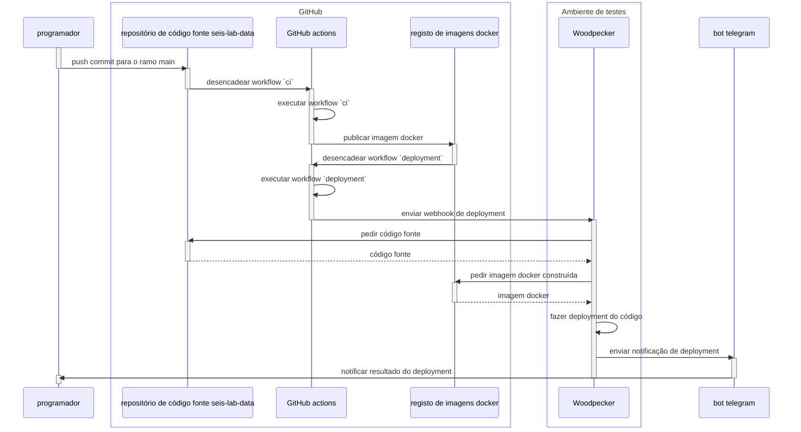

# Ambiente de testes

O ambiente de testes está disponível em <https://seis-lab-data.naturalgis.pt>


Os _deployments_ do ambiente de testes são geridos por uma instância [woodpecker] e o
workflow relevante pode ser encontrado no diretório `.woodpecker` deste repositório. Os _deployments_
são desencadeados por GitHub actions, através de uma notificação _webhook_ que é enviada pelo
workflow `.github/deployment.yml`.



O Woodpecker está a correr em <https://ci.seis-lab-data.naturalgis.pt>

Para além do conteúdo da mensagem webhook, os _deployments_ dependem de a instância woodpecker ter os
seguintes segredos definidos:

- `github_user` - Nome do utilizador GitHub que interage com o registo de contentores GitHub e obtém imagens do
  projeto
- `github_pat` - _Personal Access Token_ associado ao utilizador, para autenticação no registo de contentores
- `telegram_bot_token` - Token para o bot telegram que envia notificações relacionadas com _deployments_
- `telegram_chat_id` - Id da conversa telegram onde as notificações relacionadas com _deployments_ devem ser enviadas

No nó do ambiente de testes, os artefactos relevantes de _deployment_ estão localizados em
`/opt/seis-lab-data`. Os ficheiros mais relevantes são:

- `compose.test-env.yaml` - ficheiro docker compose que é utilizado pelo _workflow_ de _deployment_ do woodpecker
  para orquestrar _deployments_ - Este ficheiro é uma cópia do ficheiro `docker/compose.test-env.yaml` do
  repositório, que é criado pelo woodpecker durante o _deployment_. Este ficheiro não deve ser editado manualmente; se
  for necessário alterá-lo, fazer _commit_ de quaisquer alterações no repositório
- `compose-deployment.env`, contém variáveis de ambiente utilizadas pelo ficheiro compose e é crucial para os
  _deployments_ funcionarem corretamente

Existem outros ficheiros relacionados com _deployment_ em `/opt/seis-lab-data`, que não devem ser modificados.


!!! note "Nota"

    Sempre que houver necessidade de ligar manualmente ao ambiente de testes, preferir utilizar um gestor de
    sessões de terminal, pois manterá a sessão a correr em caso de quebra inesperada de ligação. O [byobu] é uma boa
    opção:

    ```shell
    # verificar se já existem sessões criadas:
    byobu ls

    # criar uma nova sessão (dar-lhe o seu próprio nome)
    byobu new -s ricardo-silva

    # desanexar da sessão premindo a tecla <F6>

    # voltar a anexar a uma sessão nomeada (pode anexar-se à sessão de outra pessoa, se necessário)
    byobu attach -t ricardo-silva

    # a sessão pode ser fechada simplesmente fechando a ligação, i.e. premir <ctrl+d> ou escrever `quit`
    ```

[byobu]: https://www.byobu.org/documentation


## Consultar logs

O acesso a logs relacionados com _deployment_ e operação pode ser feito usando as funcionalidades normais do docker.

!!! NOTE "Nota"
    O ficheiro `compose.test-env.yaml` espera encontrar algumas variáveis de ambiente para funcionar
    corretamente. Assim sendo, todos os comandos docker devem incluir a indicação do ficheiro que contem
    estas variáveis:

    ```shell
    docker compose -f compose.test-env.yaml --env-file compose-deplyment.env \
        <comando-docker> <nome-serviço>
    ```


Os logs de _deployment_ podem ser inspecionados através dos logs da stack compose do woodpecker:

```shell
# ver logs dos últimos dez minutos e continuar a seguir os logs
docker logs -f --since 10m woodpecker-woodpecker-server-1
```

O sistema em execução também usa uma instância traefik como _reverse proxy_. Esta instância está
configurada no seu próprio ficheiro compose e os logs podem ser inspecionados com:

```shell
docker logs -f --since 10m traefik-traefik-1
```

Os logs do serviço seis-lab-data podem ser verificados com:

```shell
# exemplo de verificação dos logs do serviço 'webapp'
docker logs -f --since 10m seis-lab-data-webapp-1
```


[docker]: https://www.docker.com/
[IPMA]: https://www.ipma.pt/pt/index.html
[pre-commit]: https://pre-commit.com/
[uv]: https://docs.astral.sh/uv/
[woodpecker]: https://woodpecker-ci.org/
